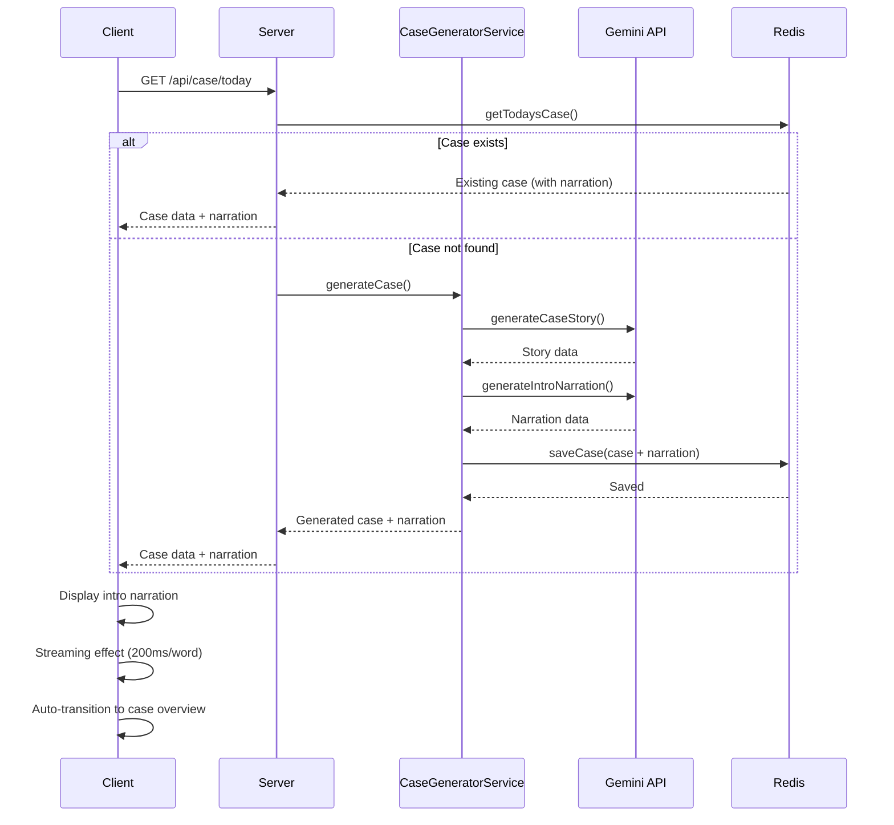
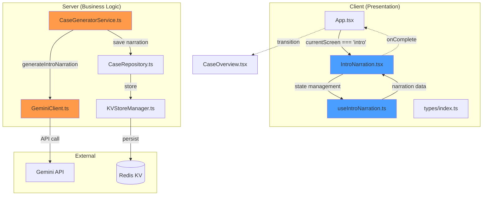

# Intro Narration System Design

## Overview

인트로 나레이션 시스템은 Gemini API를 사용하여 케이스별로 맞춤화된 3단계 나레이션을 생성하고, 클라이언트에서 타이핑 효과로 표시하는 시스템입니다. 케이스 생성 시점에 나레이션도 함께 생성되어 기존 게임 시스템에 seamless하게 통합됩니다.

## User Flow

```
1. 게임 시작
   ↓
2. 로딩 화면 (1-2초)
   ↓
3. GET /api/case/today 호출
   ├─ 케이스 존재: 기존 케이스 로드 (나레이션 포함)
   └─ 케이스 없음: 새 케이스 생성 (나레이션 포함)
   ↓
4. 인트로 나레이션 화면
   ├─ Phase 1: Atmosphere (15-20초)
   │   - 타이핑 효과로 텍스트 표시
   │   - Skip 버튼 표시
   ├─ Phase 2: Incident (15-20초)
   │   - 타이핑 효과로 텍스트 표시
   │   - Skip 버튼 표시
   └─ Phase 3: Stakes (15-20초)
       - 타이핑 효과로 텍스트 표시
       - Skip 버튼 표시
   ↓
5. 케이스 개요 화면 (자동 전환)
   ↓
6. 게임 진행
```

**Skip 옵션:**
```
사용자가 Skip 버튼 클릭 또는 Space/Enter 키 입력
   ↓
현재 Phase 전체 텍스트 즉시 표시
   ↓
1초 후 다음 Phase 또는 완료
   ↓
총 소요 시간: 5-10초
```

## Data Flow



## Architecture

### Module Diagram



## Components and Interfaces

### 1. Types (Shared)

**Location:** `src/client/types/index.ts`

```typescript
// 나레이션 페이즈
export type NarrationPhase = 'atmosphere' | 'incident' | 'stakes';

// 인트로 나레이션 데이터
export interface IntroNarration {
  atmosphere: string;    // 50-80 단어
  incident: string;      // 50-80 단어
  stakes: string;        // 50-90 단어
}

// GameScreen에 'intro' 추가
export type GameScreen =
  | 'loading'
  | 'intro'              // 새로 추가
  | 'case-overview'
  | 'investigation'
  | 'submission'
  | 'results';
```

### 2. CaseGeneratorService (Business Logic)

**Location:** `src/server/services/case/CaseGeneratorService.ts`

**New Methods:**

```typescript
class CaseGeneratorService {
  /**
   * 인트로 나레이션 생성 (Gemini API)
   */
  private async generateIntroNarration(
    caseStory: {
      victim: { name: string; background: string };
      suspects: Array<{ name: string }>;
    },
    weapon: Weapon,
    location: Location,
    temperature: number
  ): Promise<IntroNarration> {
    const prompt = this.buildIntroNarrationPrompt(
      caseStory,
      weapon,
      location
    );

    const response = await this.geminiClient.generateText(prompt, {
      temperature,
      maxTokens: 1024
    });

    return this.geminiClient.parseJsonResponse(response.text);
  }

  /**
   * 인트로 나레이션 프롬프트 생성
   */
  private buildIntroNarrationPrompt(
    caseStory: {
      victim: { name: string; background: string };
      suspects: Array<{ name: string }>;
    },
    weapon: Weapon,
    location: Location
  ): string {
    return `당신은 탐정 소설 작가입니다. 다음 케이스에 대한 몰입감 있는 인트로 나레이션을 생성하세요.

**케이스 정보:**
- 피해자: ${caseStory.victim.name}
- 피해자 배경: ${caseStory.victim.background}
- 장소: ${location.name}
- 장소 설명: ${location.description}
- 무기: ${weapon.name}
- 용의자 수: ${caseStory.suspects.length}명

**나레이션 구조 (3단계):**

1. **Atmosphere (분위기 설정, 50-80 단어)**
   - 장소와 시간대 묘사
   - 감각적 디테일 (시각, 청각, 후각)
   - 긴장감 조성
   - 예: "고풍스러운 저택이 폭풍우 속에 우뚝 서 있다. 번개가 높은 창문을 비추며 샹들리에가 떨리는 그림자를 드리운다..."

2. **Incident (사건 발생, 50-80 단어)**
   - 피해자 발견
   - 현장 상태
   - 침입 흔적 없음
   - 예: "${caseStory.victim.name}, ${location.name}에서 사망한 채 발견되었다. ${weapon.name}이(가) 현장에 있다. 침입 흔적은 없다..."

3. **Stakes (플레이어 역할, 50-90 단어)**
   - 탐정으로서의 임무
   - 용의자 정보
   - 시간 압박
   - 행동 촉구
   - 예: "당신은 형사다. ${caseStory.suspects.length}명의 용의자가 건물 안에 있었다. 보안 영상에는 아무도 나가지 않았다. 누군가는 뭔가를 알고 있다..."

**중요:**
- 각 단계는 지정된 단어 수 범위를 준수해야 함
- 한국어로 작성
- 몰입감 있고 긴장감 있는 문체
- 구체적이고 감각적인 묘사

**응답 형식 (JSON):**
\`\`\`json
{
  "atmosphere": "...",
  "incident": "...",
  "stakes": "..."
}
\`\`\`

JSON만 응답하세요. 다른 설명은 필요 없습니다.`;
  }

  /**
   * 기본 나레이션 생성 (Fallback)
   */
  private generateFallbackNarration(
    caseStory: {
      victim: { name: string; background: string };
      suspects: Array<{ name: string }>;
    },
    weapon: Weapon,
    location: Location
  ): IntroNarration {
    return {
      atmosphere: `${location.name}. 어둠이 내려앉은 밤, 긴장감이 감돈다. 무언가 끔찍한 일이 일어났다.`,
      incident: `${caseStory.victim.name}이(가) ${location.name}에서 사망한 채 발견되었다. ${weapon.name}이(가) 현장에 있다. 침입 흔적은 없다.`,
      stakes: `당신은 형사다. ${caseStory.suspects.length}명의 용의자가 있다. 진실을 밝혀내야 한다.`
    };
  }
}
```

**Modified Method:**

```typescript
async generateCase(options: GenerateCaseOptions = {}): Promise<GeneratedCase> {
  // ... 기존 코드 ...

  // 2. 케이스 스토리 생성 (Gemini)
  const caseStory = await this.generateCaseStory(
    elements.weapon,
    elements.motive,
    elements.location,
    elements.suspects,
    temperature
  );

  console.log(`✅ Case story generated`);

  // 2.5. 인트로 나레이션 생성 (NEW!)
  let introNarration: IntroNarration;
  try {
    introNarration = await this.generateIntroNarration(
      caseStory,
      elements.weapon,
      elements.location,
      temperature
    );
    console.log(`✅ Intro narration generated`);
  } catch (error) {
    console.error('❌ Narration generation failed:', error);
    // Fallback to basic narration
    introNarration = this.generateFallbackNarration(
      caseStory,
      elements.weapon,
      elements.location
    );
    console.log(`✅ Fallback narration generated`);
  }

  // 3. 케이스 이미지 생성 (선택)
  // ... 기존 코드 ...

  // 4. CaseRepository에 저장
  const createInput: CreateCaseInput = {
    // ... 기존 필드 ...
    introNarration  // 새로 추가
  };

  // ... 나머지 코드 ...
}
```

### 3. KVStoreManager (Data Layer)

**Location:** `src/server/services/repositories/kv/KVStoreManager.ts`

**Modified Interface:**

```typescript
export interface CaseData {
  id: string;
  date: string;
  victim: {
    name: string;
    background: string;
    relationship: string;
  };
  weapon: {
    name: string;
    description: string;
  };
  location: {
    name: string;
    description: string;
  };
  suspects: Array<{
    id: string;
    name: string;
    archetype: string;
    isGuilty: boolean;
  }>;
  solution: {
    who: string;
    what: string;
    where: string;
    when: string;
    why: string;
    how: string;
  };
  generatedAt: number;
  imageUrl?: string;
  introNarration?: IntroNarration;  // 새로 추가
}
```

### 4. CaseRepository (Data Access)

**Location:** `src/server/services/repositories/kv/CaseRepository.ts`

**Modified Interface:**

```typescript
export interface CreateCaseInput {
  victim: {
    name: string;
    background: string;
    relationship: string;
  };
  weapon: {
    name: string;
    description: string;
  };
  location: {
    name: string;
    description: string;
  };
  suspects: Array<{
    name: string;
    archetype: string;
    background: string;
    personality: string;
    isGuilty: boolean;
    profileImageUrl?: string;
  }>;
  solution: {
    who: string;
    what: string;
    where: string;
    when: string;
    why: string;
    how: string;
  };
  imageUrl?: string;
  introNarration?: IntroNarration;  // 새로 추가
}
```

### 5. useIntroNarration Hook (Presentation Logic)

**Location:** `src/client/hooks/useIntroNarration.ts`

```typescript
interface UseIntroNarrationReturn {
  // 현재 표시 중인 텍스트
  displayedText: string;
  
  // 현재 페이즈
  currentPhase: NarrationPhase | null;
  
  // 스트리밍 완료 여부
  isComplete: boolean;
  
  // Skip 함수
  skip: () => void;
  
  // 다음 페이즈로 진행
  nextPhase: () => void;
}

export function useIntroNarration(
  narration: IntroNarration
): UseIntroNarrationReturn {
  const [currentPhase, setCurrentPhase] = useState<NarrationPhase>('atmosphere');
  const [displayedText, setDisplayedText] = useState<string>('');
  const [isComplete, setIsComplete] = useState<boolean>(false);
  const [isSkipped, setIsSkipped] = useState<boolean>(false);

  // 스트리밍 로직
  useEffect(() => {
    if (isComplete) return;

    const phaseText = narration[currentPhase];
    const words = phaseText.split(' ');
    let currentIndex = 0;

    if (isSkipped) {
      // Skip: 전체 텍스트 즉시 표시
      setDisplayedText(phaseText);
      setIsSkipped(false);
      return;
    }

    // 단어 단위 스트리밍 (200ms 간격)
    const interval = setInterval(() => {
      if (currentIndex < words.length) {
        setDisplayedText(words.slice(0, currentIndex + 1).join(' '));
        currentIndex++;
      } else {
        clearInterval(interval);
        // 페이즈 완료 후 1초 대기
        setTimeout(() => {
          nextPhase();
        }, 1000);
      }
    }, 200);

    return () => clearInterval(interval);
  }, [currentPhase, isSkipped, narration, isComplete]);

  const skip = useCallback(() => {
    setIsSkipped(true);
  }, []);

  const nextPhase = useCallback(() => {
    if (currentPhase === 'atmosphere') {
      setCurrentPhase('incident');
      setDisplayedText('');
    } else if (currentPhase === 'incident') {
      setCurrentPhase('stakes');
      setDisplayedText('');
    } else {
      setIsComplete(true);
    }
  }, [currentPhase]);

  return {
    displayedText,
    currentPhase,
    isComplete,
    skip,
    nextPhase
  };
}
```

### 6. IntroNarration Component (Presentation)

**Location:** `src/client/components/intro/IntroNarration.tsx`

```typescript
interface IntroNarrationProps {
  caseData: CaseData;
  onComplete: () => void;
}

export function IntroNarration({ caseData, onComplete }: IntroNarrationProps) {
  const { displayedText, currentPhase, isComplete, skip } = useIntroNarration(
    caseData.introNarration!
  );

  // 완료 시 콜백 호출
  useEffect(() => {
    if (isComplete) {
      setTimeout(() => {
        onComplete();
      }, 1000);
    }
  }, [isComplete, onComplete]);

  // 키보드 이벤트 (Space/Enter)
  useEffect(() => {
    const handleKeyPress = (e: KeyboardEvent) => {
      if (e.key === ' ' || e.key === 'Enter') {
        e.preventDefault();
        skip();
      }
    };

    window.addEventListener('keydown', handleKeyPress);
    return () => window.removeEventListener('keydown', handleKeyPress);
  }, [skip]);

  const phaseIndex = currentPhase === 'atmosphere' ? 1 : currentPhase === 'incident' ? 2 : 3;

  return (
    <div className="intro-narration">
      <div className="narration-content">
        <p className="narration-text">{displayedText}</p>
      </div>
      
      <div className="narration-controls">
        <span className="phase-indicator">Phase {phaseIndex}/3</span>
        <button className="skip-button" onClick={skip}>
          Skip ⏭️
        </button>
      </div>
    </div>
  );
}
```

### 7. App.tsx Integration (Presentation)

**Location:** `src/client/App.tsx`

**Modified Code:**

```typescript
// useEffect 수정
useEffect(() => {
  if (caseLoading) {
    setCurrentScreen('loading');
  } else if (caseError) {
    setCurrentScreen('loading');
  } else if (caseData && currentScreen === 'loading') {
    // 나레이션이 있으면 intro로, 없으면 case-overview로
    if (caseData.introNarration) {
      setCurrentScreen('intro');
    } else {
      setCurrentScreen('case-overview');
    }
  }
}, [caseLoading, caseError, caseData, currentScreen]);

// 콜백 추가
const handleIntroComplete = useCallback(() => {
  setCurrentScreen('case-overview');
}, []);

// renderScreen에 intro 케이스 추가
if (currentScreen === 'intro' && caseData) {
  return (
    <IntroNarration 
      caseData={caseData} 
      onComplete={handleIntroComplete} 
    />
  );
}
```

## Data Models

### IntroNarration

```typescript
interface IntroNarration {
  atmosphere: string;    // 50-80 단어
  incident: string;      // 50-80 단어
  stakes: string;        // 50-90 단어
}
```

### CaseData (Modified)

```typescript
interface CaseData {
  // ... 기존 필드 ...
  introNarration?: IntroNarration;  // 새로 추가
}
```

## Error Handling

### 1. Gemini API 호출 실패

```typescript
try {
  introNarration = await this.generateIntroNarration(...);
} catch (error) {
  console.error('❌ Narration generation failed:', error);
  // Fallback to basic narration
  introNarration = this.generateFallbackNarration(...);
}
```

### 2. 나레이션 데이터 없음

```typescript
// App.tsx에서 처리
if (caseData.introNarration) {
  setCurrentScreen('intro');
} else {
  // 나레이션 없으면 바로 케이스 개요로
  setCurrentScreen('case-overview');
}
```

### 3. 타임아웃 처리

```typescript
// Gemini API 호출 시 타임아웃 설정
const response = await this.geminiClient.generateText(prompt, {
  temperature,
  maxTokens: 1024,
  timeout: 5000  // 5초 타임아웃
});
```

## Testing Strategy

### Unit Tests

**CaseGeneratorService:**

```typescript
describe('CaseGeneratorService - Intro Narration', () => {
  test('인트로 나레이션 생성 - 모든 페이즈 포함', async () => {
    // Given: 케이스 데이터
    const caseStory = { ... };
    const weapon = { ... };
    const location = { ... };

    // When: generateIntroNarration 호출
    const narration = await service.generateIntroNarration(
      caseStory,
      weapon,
      location,
      0.8
    );

    // Then: 3개 페이즈 모두 생성됨
    expect(narration.atmosphere).toBeDefined();
    expect(narration.incident).toBeDefined();
    expect(narration.stakes).toBeDefined();
  });

  test('단어 수 제한 준수 - 각 페이즈', async () => {
    // Given: 케이스 데이터
    // When: 나레이션 생성
    const narration = await service.generateIntroNarration(...);

    // Then: 단어 수 범위 확인
    const atmosphereWords = narration.atmosphere.split(' ').length;
    const incidentWords = narration.incident.split(' ').length;
    const stakesWords = narration.stakes.split(' ').length;

    expect(atmosphereWords).toBeGreaterThanOrEqual(50);
    expect(atmosphereWords).toBeLessThanOrEqual(80);
    expect(incidentWords).toBeGreaterThanOrEqual(50);
    expect(incidentWords).toBeLessThanOrEqual(80);
    expect(stakesWords).toBeGreaterThanOrEqual(50);
    expect(stakesWords).toBeLessThanOrEqual(90);
  });

  test('Fallback 나레이션 생성', () => {
    // Given: 케이스 데이터
    // When: generateFallbackNarration 호출
    const narration = service.generateFallbackNarration(...);

    // Then: 기본 나레이션 생성됨
    expect(narration.atmosphere).toContain(location.name);
    expect(narration.incident).toContain(victim.name);
    expect(narration.stakes).toContain('형사');
  });

  test('케이스 생성 시 나레이션 포함', async () => {
    // Given: 케이스 생성 옵션
    // When: generateCase 호출
    const generatedCase = await service.generateCase();

    // Then: 나레이션 포함됨
    expect(generatedCase.introNarration).toBeDefined();
    expect(generatedCase.introNarration.atmosphere).toBeDefined();
  });
});
```

**useIntroNarration Hook:**

```typescript
describe('useIntroNarration', () => {
  test('스트리밍 효과 - 단어 단위 표시', async () => {
    // Given: 나레이션 데이터
    const narration = {
      atmosphere: 'Test atmosphere text',
      incident: 'Test incident text',
      stakes: 'Test stakes text'
    };

    // When: Hook 사용
    const { result } = renderHook(() => useIntroNarration(narration));

    // Then: 초기 상태
    expect(result.current.currentPhase).toBe('atmosphere');
    expect(result.current.displayedText).toBe('');

    // Wait for streaming
    await waitFor(() => {
      expect(result.current.displayedText).toContain('Test');
    });
  });

  test('Skip 기능 - 전체 텍스트 즉시 표시', async () => {
    // Given: 나레이션 데이터
    // When: Skip 호출
    const { result } = renderHook(() => useIntroNarration(narration));
    act(() => {
      result.current.skip();
    });

    // Then: 전체 텍스트 표시
    await waitFor(() => {
      expect(result.current.displayedText).toBe(narration.atmosphere);
    });
  });

  test('페이즈 전환 - 3단계 순차 진행', async () => {
    // Given: 나레이션 데이터
    // When: 각 페이즈 완료
    const { result } = renderHook(() => useIntroNarration(narration));

    // Then: atmosphere → incident → stakes
    expect(result.current.currentPhase).toBe('atmosphere');
    
    await waitFor(() => {
      expect(result.current.currentPhase).toBe('incident');
    });
    
    await waitFor(() => {
      expect(result.current.currentPhase).toBe('stakes');
    });
    
    await waitFor(() => {
      expect(result.current.isComplete).toBe(true);
    });
  });
});
```

### Integration Tests

```typescript
describe('Intro Narration Integration', () => {
  test('케이스 생성부터 나레이션 표시까지', async () => {
    // Given: 새 케이스 생성
    const caseData = await CaseGeneratorService.generateCase();

    // Then: 나레이션 포함됨
    expect(caseData.introNarration).toBeDefined();

    // When: 클라이언트에서 표시
    render(<IntroNarration caseData={caseData} onComplete={jest.fn()} />);

    // Then: 나레이션 표시됨
    expect(screen.getByText(/Phase 1\/3/)).toBeInTheDocument();
  });
});
```

## Performance Considerations

### 1. Gemini API 호출 최적화

- **타임아웃**: 5초 제한
- **토큰 수**: 1024 토큰 (약 800 단어)
- **Temperature**: 0.8 (창의성과 일관성 균형)

### 2. 스트리밍 효과 최적화

- **간격**: 200ms (자연스러운 읽기 속도)
- **메모리**: useEffect cleanup으로 메모리 누수 방지
- **재렌더링**: useMemo, useCallback으로 최적화

### 3. 캐싱 전략

- **Redis**: 생성된 나레이션은 케이스와 함께 저장
- **재사용**: 동일 케이스 재조회 시 나레이션 재생성 불필요

## Security Considerations

### 1. API 키 보안

- **환경변수**: GEMINI_API_KEY는 서버 환경변수로 관리
- **클라이언트 노출 방지**: API 키는 절대 클라이언트에 노출되지 않음

### 2. 입력 검증

- **케이스 데이터**: 서버에서 생성된 데이터만 사용
- **사용자 입력 없음**: 나레이션 생성에 사용자 입력 불포함

## Accessibility

### 1. 키보드 네비게이션

- **Space/Enter**: Skip 기능
- **Tab**: Skip 버튼 포커스

### 2. 스크린 리더

- **ARIA 레이블**: 나레이션 텍스트에 적절한 레이블
- **Live Region**: 텍스트 변경 시 스크린 리더 알림

### 3. 색상 대비

- **WCAG 2.1 AA**: 4.5:1 이상 대비
- **어두운 배경**: 텍스트 가독성 보장

## Deployment Considerations

### 1. Devvit 제약사항

- **타임아웃**: 30초 내 완료 (나레이션 생성 5초 + 표시 60초)
- **번들 크기**: 최소화 (불필요한 의존성 제거)

### 2. 모니터링

- **로그**: 나레이션 생성 성공/실패 로그
- **메트릭**: 생성 시간, 실패율 추적

## UI Styling Specifications

### IntroNarration Component Styles

**Location:** `src/client/components/intro/IntroNarration.css`

```css
.intro-narration {
  position: fixed;
  top: 0;
  left: 0;
  width: 100vw;
  height: 100vh;
  background: linear-gradient(180deg, #000000 0%, #1a1a1a 100%);
  display: flex;
  flex-direction: column;
  justify-content: center;
  align-items: center;
  padding: 2rem;
  animation: fadeIn 1s ease-in;
}

.intro-narration.fade-out {
  animation: fadeOut 1s ease-out;
}

.narration-content {
  max-width: 800px;
  width: 100%;
  text-align: center;
  margin-bottom: 4rem;
}

.narration-text {
  font-size: 1.5rem;
  line-height: 2;
  color: #ffffff;
  font-family: 'Georgia', serif;
  text-shadow: 0 2px 4px rgba(0, 0, 0, 0.5);
  min-height: 200px;
}

.narration-controls {
  position: fixed;
  bottom: 2rem;
  right: 2rem;
  display: flex;
  align-items: center;
  gap: 1rem;
}

.phase-indicator {
  font-size: 0.875rem;
  color: #888888;
  font-family: monospace;
}

.skip-button {
  padding: 0.75rem 1.5rem;
  background: rgba(255, 255, 255, 0.1);
  border: 1px solid rgba(255, 255, 255, 0.3);
  border-radius: 8px;
  color: #ffffff;
  font-size: 1rem;
  cursor: pointer;
  transition: all 0.2s;
  backdrop-filter: blur(10px);
}

.skip-button:hover {
  background: rgba(255, 255, 255, 0.2);
  border-color: rgba(255, 255, 255, 0.5);
  transform: translateY(-2px);
}

.skip-button:focus {
  outline: 2px solid #4a9eff;
  outline-offset: 2px;
}

/* 애니메이션 */
@keyframes fadeIn {
  from {
    opacity: 0;
  }
  to {
    opacity: 1;
  }
}

@keyframes fadeOut {
  from {
    opacity: 1;
  }
  to {
    opacity: 0;
  }
}

/* 모바일 반응형 */
@media (max-width: 768px) {
  .narration-text {
    font-size: 1.125rem;
    line-height: 1.8;
  }

  .narration-controls {
    bottom: 1rem;
    right: 1rem;
  }

  .skip-button {
    padding: 0.5rem 1rem;
    font-size: 0.875rem;
  }
}

/* 접근성: 고대비 모드 */
@media (prefers-contrast: high) {
  .narration-text {
    color: #ffffff;
    text-shadow: none;
  }

  .skip-button {
    border: 2px solid #ffffff;
  }
}

/* 접근성: 애니메이션 감소 */
@media (prefers-reduced-motion: reduce) {
  .intro-narration {
    animation: none;
  }

  .intro-narration.fade-out {
    animation: none;
    opacity: 0;
  }
}
```

### Color Contrast Verification

- **배경**: #000000 (검은색)
- **텍스트**: #ffffff (흰색)
- **대비율**: 21:1 (WCAG AAA 기준 충족)

## Enhanced Error Handling

### 1. JSON 파싱 실패 처리

```typescript
class CaseGeneratorService {
  private async generateIntroNarration(
    caseStory: {
      victim: { name: string; background: string };
      suspects: Array<{ name: string }>;
    },
    weapon: Weapon,
    location: Location,
    temperature: number
  ): Promise<IntroNarration> {
    try {
      const prompt = this.buildIntroNarrationPrompt(
        caseStory,
        weapon,
        location
      );

      const response = await this.geminiClient.generateText(prompt, {
        temperature,
        maxTokens: 1024,
        timeout: 5000
      });

      // JSON 파싱 시도
      let narration: IntroNarration;
      try {
        narration = this.geminiClient.parseJsonResponse(response.text);
      } catch (parseError) {
        console.error('❌ JSON parsing failed:', parseError);
        console.log('Raw response:', response.text);
        throw new Error('Failed to parse narration JSON');
      }

      // 단어 수 검증
      const validation = this.validateNarrationWordCount(narration);
      if (!validation.isValid) {
        console.warn('⚠️ Word count validation failed:', validation.errors);
        // 단어 수가 맞지 않아도 사용 (경고만)
      }

      return narration;
    } catch (error) {
      console.error('❌ Narration generation failed:', error);
      throw error; // 상위에서 Fallback 처리
    }
  }

  /**
   * 나레이션 단어 수 검증
   */
  private validateNarrationWordCount(narration: IntroNarration): {
    isValid: boolean;
    errors: string[];
  } {
    const errors: string[] = [];

    const atmosphereWords = narration.atmosphere.split(' ').length;
    const incidentWords = narration.incident.split(' ').length;
    const stakesWords = narration.stakes.split(' ').length;

    if (atmosphereWords < 50 || atmosphereWords > 80) {
      errors.push(
        `Atmosphere: ${atmosphereWords} words (expected 50-80)`
      );
    }

    if (incidentWords < 50 || incidentWords > 80) {
      errors.push(
        `Incident: ${incidentWords} words (expected 50-80)`
      );
    }

    if (stakesWords < 50 || stakesWords > 90) {
      errors.push(
        `Stakes: ${stakesWords} words (expected 50-90)`
      );
    }

    return {
      isValid: errors.length === 0,
      errors
    };
  }
}
```

### 2. 타임아웃 후 처리

```typescript
// GeminiClient에서 타임아웃 처리
async generateText(
  prompt: string,
  options: {
    temperature: number;
    maxTokens: number;
    timeout?: number;
  }
): Promise<{ text: string }> {
  const controller = new AbortController();
  const timeoutId = setTimeout(() => {
    controller.abort();
  }, options.timeout || 10000);

  try {
    const response = await fetch(GEMINI_API_URL, {
      method: 'POST',
      headers: {
        'Content-Type': 'application/json',
        'Authorization': `Bearer ${process.env.GEMINI_API_KEY}`
      },
      body: JSON.stringify({
        prompt,
        temperature: options.temperature,
        max_tokens: options.maxTokens
      }),
      signal: controller.signal
    });

    clearTimeout(timeoutId);

    if (!response.ok) {
      throw new Error(`Gemini API error: ${response.status}`);
    }

    return await response.json();
  } catch (error) {
    clearTimeout(timeoutId);
    
    if (error.name === 'AbortError') {
      throw new Error('Gemini API timeout');
    }
    
    throw error;
  }
}
```

## Type Definitions

### Complete Type Definitions

**Location:** `src/shared/types/index.ts`

```typescript
// 나레이션 페이즈
export type NarrationPhase = 'atmosphere' | 'incident' | 'stakes';

// 인트로 나레이션 데이터
export interface IntroNarration {
  atmosphere: string;    // 50-80 단어
  incident: string;      // 50-80 단어
  stakes: string;        // 50-90 단어
}

// GeneratedCase 타입 (수정)
export interface GeneratedCase {
  id: string;
  date: string;
  victim: {
    name: string;
    background: string;
    relationship: string;
  };
  weapon: {
    name: string;
    description: string;
  };
  location: {
    name: string;
    description: string;
  };
  suspects: Array<{
    id: string;
    name: string;
    archetype: string;
    background: string;
    personality: string;
    isGuilty: boolean;
    profileImageUrl?: string;
  }>;
  solution: {
    who: string;
    what: string;
    where: string;
    when: string;
    why: string;
    how: string;
  };
  imageUrl?: string;
  introNarration?: IntroNarration;  // 추가
  generatedAt: number;
}

// API 응답 타입
export interface GetCaseResponse {
  success: boolean;
  case?: GeneratedCase;
  error?: string;
}
```

## Performance Optimization

### React Component Optimization

```typescript
import React, { memo, useCallback, useEffect, useState } from 'react';

// IntroNarration 컴포넌트 메모이제이션
export const IntroNarration = memo(function IntroNarration({
  caseData,
  onComplete
}: IntroNarrationProps) {
  const { displayedText, currentPhase, isComplete, skip } = useIntroNarration(
    caseData.introNarration!
  );

  // 완료 콜백 메모이제이션
  const handleComplete = useCallback(() => {
    setTimeout(() => {
      onComplete();
    }, 1000);
  }, [onComplete]);

  useEffect(() => {
    if (isComplete) {
      handleComplete();
    }
  }, [isComplete, handleComplete]);

  // 키보드 이벤트 핸들러 메모이제이션
  const handleKeyPress = useCallback((e: KeyboardEvent) => {
    if (e.key === ' ' || e.key === 'Enter') {
      e.preventDefault();
      skip();
    }
  }, [skip]);

  useEffect(() => {
    window.addEventListener('keydown', handleKeyPress);
    return () => window.removeEventListener('keydown', handleKeyPress);
  }, [handleKeyPress]);

  const phaseIndex = currentPhase === 'atmosphere' ? 1 : currentPhase === 'incident' ? 2 : 3;

  return (
    <div className="intro-narration">
      <div className="narration-content">
        <p className="narration-text" role="status" aria-live="polite">
          {displayedText}
        </p>
      </div>
      
      <div className="narration-controls">
        <span className="phase-indicator" aria-label={`Phase ${phaseIndex} of 3`}>
          Phase {phaseIndex}/3
        </span>
        <button 
          className="skip-button" 
          onClick={skip}
          aria-label="Skip narration"
        >
          Skip ⏭️
        </button>
      </div>
    </div>
  );
});
```

### useIntroNarration Hook Optimization

```typescript
export function useIntroNarration(
  narration: IntroNarration
): UseIntroNarrationReturn {
  const [currentPhase, setCurrentPhase] = useState<NarrationPhase>('atmosphere');
  const [displayedText, setDisplayedText] = useState<string>('');
  const [isComplete, setIsComplete] = useState<boolean>(false);
  const [isSkipped, setIsSkipped] = useState<boolean>(false);

  // nextPhase 메모이제이션
  const nextPhase = useCallback(() => {
    if (currentPhase === 'atmosphere') {
      setCurrentPhase('incident');
      setDisplayedText('');
    } else if (currentPhase === 'incident') {
      setCurrentPhase('stakes');
      setDisplayedText('');
    } else {
      setIsComplete(true);
    }
  }, [currentPhase]);

  // skip 메모이제이션
  const skip = useCallback(() => {
    setIsSkipped(true);
  }, []);

  // 스트리밍 로직
  useEffect(() => {
    if (isComplete) return;

    const phaseText = narration[currentPhase];
    const words = phaseText.split(' ');
    let currentIndex = 0;

    if (isSkipped) {
      setDisplayedText(phaseText);
      setIsSkipped(false);
      
      // 1초 후 다음 페이즈
      const skipTimeout = setTimeout(() => {
        nextPhase();
      }, 1000);
      
      return () => clearTimeout(skipTimeout);
    }

    // 단어 단위 스트리밍
    const interval = setInterval(() => {
      if (currentIndex < words.length) {
        setDisplayedText(words.slice(0, currentIndex + 1).join(' '));
        currentIndex++;
      } else {
        clearInterval(interval);
        
        // 페이즈 완료 후 1초 대기
        const completeTimeout = setTimeout(() => {
          nextPhase();
        }, 1000);
        
        return () => clearTimeout(completeTimeout);
      }
    }, 200);

    return () => clearInterval(interval);
  }, [currentPhase, isSkipped, narration, isComplete, nextPhase]);

  return {
    displayedText,
    currentPhase,
    isComplete,
    skip,
    nextPhase
  };
}
```

## Additional Test Cases

### Error Scenario Tests

```typescript
describe('CaseGeneratorService - Error Handling', () => {
  test('JSON 파싱 실패 시 Fallback 사용', async () => {
    // Given: Gemini API가 잘못된 JSON 반환
    mockGeminiClient.generateText.mockResolvedValue({
      text: 'Invalid JSON response'
    });

    // When: generateCase 호출
    const generatedCase = await service.generateCase();

    // Then: Fallback 나레이션 사용됨
    expect(generatedCase.introNarration).toBeDefined();
    expect(generatedCase.introNarration.atmosphere).toContain('어둠이 내려앉은');
  });

  test('타임아웃 시 Fallback 사용', async () => {
    // Given: Gemini API 타임아웃
    mockGeminiClient.generateText.mockRejectedValue(
      new Error('Gemini API timeout')
    );

    // When: generateCase 호출
    const generatedCase = await service.generateCase();

    // Then: Fallback 나레이션 사용됨
    expect(generatedCase.introNarration).toBeDefined();
  });

  test('단어 수 초과 시 경고만 출력', async () => {
    // Given: 단어 수가 초과된 나레이션
    const longNarration = {
      atmosphere: 'word '.repeat(100), // 100 단어 (80 초과)
      incident: 'word '.repeat(60),
      stakes: 'word '.repeat(70)
    };

    mockGeminiClient.parseJsonResponse.mockReturnValue(longNarration);

    // When: generateIntroNarration 호출
    const narration = await service.generateIntroNarration(...);

    // Then: 경고 출력되지만 나레이션 반환됨
    expect(narration).toEqual(longNarration);
    expect(console.warn).toHaveBeenCalledWith(
      expect.stringContaining('Word count validation failed')
    );
  });
});
```

### Accessibility Tests

```typescript
describe('IntroNarration - Accessibility', () => {
  test('ARIA 레이블 존재', () => {
    // Given: 나레이션 데이터
    const caseData = { introNarration: mockNarration };

    // When: 컴포넌트 렌더링
    render(<IntroNarration caseData={caseData} onComplete={jest.fn()} />);

    // Then: ARIA 레이블 확인
    expect(screen.getByRole('status')).toBeInTheDocument();
    expect(screen.getByLabelText(/Phase \d of 3/)).toBeInTheDocument();
    expect(screen.getByLabelText('Skip narration')).toBeInTheDocument();
  });

  test('키보드 네비게이션 작동', () => {
    // Given: 컴포넌트 렌더링
    render(<IntroNarration caseData={caseData} onComplete={jest.fn()} />);

    // When: Tab 키로 Skip 버튼 포커스
    const skipButton = screen.getByRole('button', { name: /skip/i });
    skipButton.focus();

    // Then: 포커스 확인
    expect(skipButton).toHaveFocus();
  });

  test('스크린 리더가 텍스트 읽을 수 있음', () => {
    // Given: 컴포넌트 렌더링
    render(<IntroNarration caseData={caseData} onComplete={jest.fn()} />);

    // Then: role="status" 및 aria-live="polite" 확인
    const textElement = screen.getByRole('status');
    expect(textElement).toHaveAttribute('aria-live', 'polite');
  });
});
```

### Performance Tests

```typescript
describe('IntroNarration - Performance', () => {
  test('메모리 누수 없음 - cleanup 함수 실행', () => {
    // Given: 컴포넌트 마운트
    const { unmount } = render(
      <IntroNarration caseData={caseData} onComplete={jest.fn()} />
    );

    // When: 언마운트
    unmount();

    // Then: 이벤트 리스너 제거 확인
    // (실제로는 jest.spyOn으로 removeEventListener 호출 확인)
  });

  test('불필요한 재렌더링 방지 - React.memo', () => {
    // Given: 동일한 props
    const { rerender } = render(
      <IntroNarration caseData={caseData} onComplete={jest.fn()} />
    );

    // When: 동일한 props로 재렌더링
    rerender(
      <IntroNarration caseData={caseData} onComplete={jest.fn()} />
    );

    // Then: 재렌더링 횟수 확인
    // (React DevTools Profiler로 확인)
  });
});
```

## Future Enhancements (Phase 2)

1. **음향 효과**
   - 배경 음악 (긴장감 있는 BGM)
   - 효과음 (천둥, 빗소리)

2. **시각 효과**
   - 케이스 이미지 배경
   - 파티클 효과 (비, 안개)
   - 시네마틱 전환

3. **사용자 설정**
   - 나레이션 속도 조절
   - 자동 Skip 옵션
   - 인트로 비활성화

4. **음성 나레이션**
   - TTS (Text-to-Speech)
   - 다국어 지원
