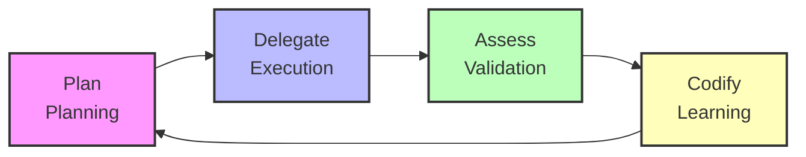

# Compounding Engineering Philosophy for Kiro IDE

## 🎯 Core Principle

**"Each unit of engineering work should make the next work easier - not harder"**



## 📊 4-Phase Cycle

### 1. Plan (Planning)
- **Kiro Mapping**: Spec System
- **Goal**: Plan work clearly and specifically
- **Compounding Effect**: Automatically reflect learnings from past projects

**Implementation in Kiro:**
- Reference `.kiro/steering/learnings/` when creating specs
- Auto-apply patterns from similar past projects
- Prevent frequently occurring issues in advance

### 2. Delegate (Execution)
- **Kiro Mapping**: Task Execution
- **Goal**: Execute planned work efficiently
- **Compounding Effect**: Reuse verified patterns and templates

**Implementation in Kiro:**
- Utilize success patterns from `.kiro/steering/patterns/`
- Systematic approach with Sequential Thinking MCP
- Reference latest best practices with Context7 MCP

### 3. Assess (Validation)
- **Kiro Mapping**: Multi-Review System (NEW!)
- **Goal**: Validate work results from multiple angles
- **Compounding Effect**: Validation criteria improve with each project

**Implementation in Kiro:**
- Auto-execute reviews with Kiro Hooks
- Utilize checklists from `.kiro/steering/reviewers/`
- Auto-validate on file save and task completion

### 4. Codify (Learning)
- **Kiro Mapping**: Learning System (NEW!)
- **Goal**: Systematically record learnings from projects
- **Compounding Effect**: Team knowledge accumulates and is shared

**Implementation in Kiro:**
- Auto-extract learnings on project completion
- Save to `.kiro/steering/learnings/`
- Auto-reference in next projects

## 💎 Compounding Effect

### Project 1
- Setup Time: 2 hours
- Issues Found: 15
- Time to Fix: 8 hours
- Total Time: 40 hours

### Project 2 (Learnings Applied)
- Setup Time: 30min ↓75%
- Issues Found: 8 ↓47%
- Time to Fix: 3hr ↓62%
- Total Time: 28hr ↓30%

### Project 3 (More Learnings)
- Setup Time: 15min ↓87%
- Issues Found: 3 ↓80%
- Time to Fix: 1hr ↓87%
- Total Time: 20hr ↓50%

## 🚀 Implementation Strategy in Kiro IDE

### Phase 1: Foundation (Week 1-2)
1. **Build Steering Files Structure**
   - `.kiro/steering/compounding/` - Philosophy and workflow
   - `.kiro/steering/reviewers/` - Reviewer checklists
   - `.kiro/steering/learnings/` - Project learnings
   - `.kiro/steering/patterns/` - Success/failure patterns

2. **Create Basic Reviewers**
   - security-reviewer.md
   - performance-reviewer.md
   - architecture-reviewer.md
   - code-quality-reviewer.md

### Phase 2: Assess Layer (Week 3-4)
1. **Implement Kiro Hooks**
   - assess-on-save.kiro.hook - Auto-review on file save
   - assess-on-task-complete.kiro.hook - Validation on task completion
   - assess-before-deploy.kiro.hook - Final validation before deployment

2. **Multi-Review System**
   - Multiple reviewers validate simultaneously
   - Auto-fix suggestions
   - Immediate notification on issue discovery

### Phase 3: Codify Layer (Week 5-6)
1. **Implement Learning System**
   - codify-on-project-complete.kiro.hook
   - Auto-extract patterns
   - Auto-generate/update Steering files

2. **Build Knowledge Base**
   - Accumulate learnings per project
   - Share team-wide knowledge
   - Version control with Git

### Phase 4: Integration (Week 7-8)
1. **Spec Enhancement**
   - enhance-spec.kiro.hook
   - Auto-inject past learnings
   - Reference similar projects

2. **Sequential Thinking Integration**
   - Auto-execute before all work
   - Reference past patterns
   - Suggest optimal approaches

## 🎨 Innovative Ideas

### 1. Self-Improving Steering Files
- Steering files auto-improve with each project
- Auto-add to checklist when new issues discovered
- Compounding effect: Checklists become increasingly perfect

### 2. Context-Aware Spec Generation
- Auto-reference similar past projects when creating new specs
- Auto-apply domain-specific best practices
- Compounding effect: Spec quality improves with each project

### 3. AI-Powered Pattern Recognition
- Auto-recognize patterns with Sequential Thinking MCP
- Add success patterns to successful-patterns.md
- Add failure patterns to anti-patterns.md

### 4. Compounding Metrics Dashboard
- Auto-track improvement metrics per project
- Issue occurrence count, fix time, code quality score
- Visualization: See compounding effect in graphs

### 5. Team Knowledge Sharing
- Share `.kiro/steering/` folder via Git
- Auto-sync team members' learnings
- Team-wide knowledge compounds

## 📋 Practical Application Example

### Before (Regular Development)
```
1. Spec: "Create user authentication system"
2. Generate Requirements
3. Generate Design
4. Break down Tasks
5. Execute
6. Complete
```

### After (Compounding Engineering)
```
1. Create Spec
   → Auto-reference auth-systems.md
   → Auto-add "CSRF protection", "Rate Limiting"
   → Auto-add "Use bcrypt"

2. Generate Design
   → Reference successful-patterns.md
   → Recommend "JWT + OAuth2" architecture
   → Prevent past issues in advance

3. Execute Tasks
   → Auto-execute assess-on-save Hook
   → Auto-validate security checklist
   → Immediate notification on issue discovery

4. Complete Task
   → Execute assess-on-task-complete Hook
   → Auto-execute Multi-Review
   → Confirm all checklists passed

5. Complete Project
   → Execute codify-on-project-complete Hook
   → Auto-extract learnings
   → Update auth-systems.md

6. Next Project
   → All these learnings auto-applied!
```

## 🎯 Success Indicators

### Short-term (1-2 months)
- [ ] Complete basic Steering file structure
- [ ] Complete 4 reviewers
- [ ] First Hook working
- [ ] First learning content recorded

### Mid-term (3-6 months)
- [ ] 30% time reduction in Project 2
- [ ] 50% fewer issues
- [ ] Stabilized auto-review system
- [ ] Team-wide Knowledge Base built

### Long-term (6-12 months)
- [ ] 50% time reduction in Project 3
- [ ] 80% fewer issues
- [ ] Self-Improving Steering Files working
- [ ] AI-Powered Pattern Recognition implemented

## 💡 Key Message

> **"What if each project becomes 30-50% faster and easier than the previous one?"**
> 
> **This is the promise of Compounding Engineering!**

---

**References:**
- `.kiro/references/every-marketplace/` - Every Inc's Compounding Engineering implementation
- `docs.md/compounding.md` - Kiro IDE application method
- `docs.md/compounding engin.md` - Every Marketplace detailed analysis
