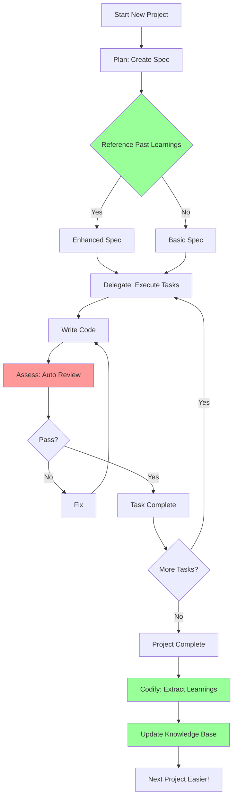

# Compounding Engineering Workflow

## 🔄 Complete Workflow



## 📝 Phase 1: Plan (Planning)

### Step 1: Start Spec Creation
```
User: "I want to create a user authentication system"
```

### Step 2: Auto-Reference Past Learnings
Kiro automatically checks:
- Does `.kiro/steering/learnings/auth-systems.md` exist?
- Are there related patterns in `.kiro/steering/patterns/successful-patterns.md`?
- Are there similar past projects?

### Step 3: Generate Enhanced Spec
```markdown
# User Authentication System Spec

## Requirements (Auto-Enhanced)
### Basic Features
- Sign up
- Login
- Logout

### Security (Auto-added from past learnings)
- ✅ Password hashing with bcrypt
- ✅ CSRF protection
- ✅ Rate limiting
- ✅ 2FA support

### Testing (Auto-added from past learnings)
- Unit tests
- Integration tests
- Security tests

## Design (Recommended from past patterns)
- Architecture: JWT + OAuth2
- Database: PostgreSQL with RLS
- Security: HTTPS only, Secure cookies
```

### Step 4: Steering Points - Requirements Review
```
🛑 Steering Point: Requirements Review

Auto-checks:
✅ Security requirements included
✅ Test plan present
⚠️ Password policy needs specification

User confirmation needed: Yes
```

## 🚀 Phase 2: Delegate (Execution)

### Step 1: Break Down Tasks
```markdown
## Tasks
1. Create User Model
   - Hints (from past learnings):
     * Hash passwords with bcrypt
     * Add email uniqueness constraint
     * Add created_at, updated_at

2. Create Auth Controller
   - Security Checks (auto-added):
     * CSRF token validation
     * Rate limiting
     * Input sanitization

3. Write Tests
   - Coverage (from past learnings):
     * Minimum 80% coverage
     * Include edge cases
```

### Step 2: Execute Task with Sequential Thinking
```
Kiro: [Auto-execute Sequential Thinking MCP]
1. Plan User Model creation
2. Reference past patterns
3. Check security checklist
4. Start implementation
```

### Step 3: Write Code
```typescript
// User Model
export class User {
  // Kiro suggests based on past patterns
  id: string;
  email: string;
  passwordHash: string; // Use bcrypt
  createdAt: Date;
  updatedAt: Date;
}
```

## ✅ Phase 3: Assess (Validation)

### Step 1: Auto-Review on File Save
```
[assess-on-save Hook executes]

Security Reviewer:
✅ Password hashed with bcrypt
✅ Email has uniqueness constraint
⚠️ Rate limiting missing

Performance Reviewer:
✅ Indexes properly configured
✅ Queries optimized

Code Quality Reviewer:
✅ TypeScript types perfect
✅ Naming conventions followed
```

### Step 2: Immediate Notification on Issue Discovery
```
🚨 Issue Found: Rate Limiting Missing

Auto-fix suggestion:
```typescript
// Add rate limiting middleware
import rateLimit from 'express-rate-limit';

const authLimiter = rateLimit({
  windowMs: 15 * 60 * 1000, // 15 minutes
  max: 5 // 5 requests per window
});

app.use('/auth', authLimiter);
```

Apply fix? [Yes/No]
```

### Step 3: Multi-Review on Task Completion
```
[assess-on-task-complete Hook executes]

Multi-Review Results:
✅ Security: All checks passed
✅ Performance: Optimized
✅ Architecture: Follows patterns
✅ Code Quality: High standard

Task completion approved!
```

## 📚 Phase 4: Codify (Learning)

### Step 1: Project Completion
```
User: "Authentication system complete!"
Kiro: "Congratulations! Recording learnings."
```

### Step 2: Auto-Extract Learnings
```
[codify-on-project-complete Hook executes]

Extracting patterns...
✅ Found 3 success patterns
✅ Recorded 2 issues
✅ Identified 5 improvements
```

### Step 3: Create Learning File
```markdown
# Authentication System Project Learnings (2025-01-14)

## Success Patterns
1. **JWT + OAuth2 Architecture**
   - Good scalability
   - Strong security
   - Simple implementation

2. **bcrypt Password Hashing**
   - Secure hashing
   - Auto salt generation
   - Appropriate performance

3. **Rate Limiting**
   - DDoS protection
   - Brute force prevention
   - Doesn't harm UX

## Issues Encountered
1. **Rate Limiting Initially Missing**
   - Cause: Not in checklist
   - Solution: assess-on-save Hook discovered it
   - Lesson: Need to add to checklist

2. **CSRF Token Validation Missing**
   - Cause: Discovered during frontend integration
   - Solution: Added middleware
   - Lesson: Need to strengthen integration testing

## Apply to Next Project
1. Include rate limiting from start
2. Add CSRF protection by default
3. Start integration testing earlier
4. Make 2FA default instead of optional
5. Strengthen password policy

## Metrics
- Setup Time: 45min
- Issues Found: 2
- Time to Fix: 1hr
- Total Time: 25hr
- vs Previous: -37% time reduction
```

### Step 4: Auto-Update Steering Files
```
[security-reviewer.md updated]

Added checklist items:
✅ Is rate limiting implemented?
✅ Is CSRF protection enabled?

[successful-patterns.md updated]

Added patterns:
✅ JWT + OAuth2 for authentication
✅ bcrypt for password hashing
✅ Rate limiting for API endpoints
```

## 🔄 Compounding Effect in Next Project

### Project 2: Payment System
```
1. Create Spec
   → Auto-reference auth-systems.md
   → Auto-include rate limiting
   → Auto-include CSRF protection
   → Security checklist more complete

2. Execute Tasks
   → Prevent past issues in advance
   → Reuse verified patterns
   → Faster implementation

3. Assess
   → Stronger checklist
   → Fewer issues found
   → Faster fixes

4. Codify
   → More learnings accumulated
   → Better pattern recognition
   → Stronger Knowledge Base
```

## 📊 Workflow Optimization Tips

### 1. Optimize Plan Phase
- Always reference past projects
- Utilize learnings from similar domains
- Prevent frequently occurring issues in advance

### 2. Optimize Delegate Phase
- Always use Sequential Thinking
- Prioritize verified patterns
- Check latest best practices with Context7

### 3. Optimize Assess Phase
- Auto-review on every file save
- Fix immediately when issues found
- Always validate before task completion

### 4. Optimize Codify Phase
- Always record learnings on project completion
- Document patterns clearly
- Share learnings with team

## 🎯 Workflow Checklist

### On Project Start
- [ ] Check similar past projects
- [ ] Read related learnings
- [ ] Reference success patterns
- [ ] Avoid failure patterns

### During Development
- [ ] Use Sequential Thinking
- [ ] Check auto-review on file save
- [ ] Fix immediately when issues found
- [ ] Follow checklists

### On Task Completion
- [ ] Pass Multi-Review
- [ ] Pass all tests
- [ ] Update documentation
- [ ] Prepare next task

### On Project Completion
- [ ] Extract learnings
- [ ] Update Steering files
- [ ] Record metrics
- [ ] Share with team

## 💡 Keys to Success

1. **Consistency**: Apply same workflow to all projects
2. **Recording**: Record all learnings without omission
3. **Sharing**: Entire team utilizes Knowledge Base
4. **Improvement**: Continuously improve workflow
5. **Automation**: Automate everything possible

---

**Next Steps:**
- Check reviewer files in `.kiro/steering/reviewers/`
- Configure Hook files in `.kiro/hooks/`
- Apply workflow in first project
