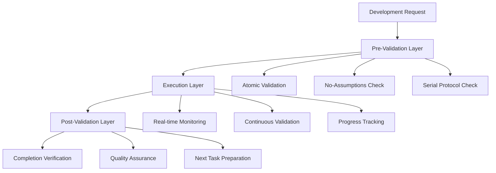

# Comprehensive Development Enforcement System

## Overview: Triple-Redundant Validation Architecture

This system implements three redundant enforcement mechanisms for each development principle, ensuring consistent application of atomic development, no-assumptions policy, and serial development protocols.

## Enforcement Architecture



## Redundant Enforcement Mechanisms

### Mechanism 1: Pre-Execution Validation (Prevention)

#### Atomic Development Pre-Validation
```typescript
interface AtomicPreValidator {
  validateTaskGranularity(task: string): ValidationResult
  checkSingleResponsibility(description: string): boolean
  verifyTestability(scope: string): boolean
  confirmDependencyIsolation(requirements: string[]): boolean
}

class AtomicTaskValidator implements AtomicPreValidator {
  validateTaskGranularity(task: string): ValidationResult {
    const wordCount = task.split(' ').length
    const hasMultipleActions = /and|also|plus|additionally/i.test(task)
    const hasMultipleComponents = /,|\+|&/.test(task)
    
    return {
      isValid: wordCount <= 10 && !hasMultipleActions && !hasMultipleComponents,
      violations: this.identifyViolations(task),
      suggestions: this.generateSuggestions(task)
    }
  }
}
```

#### No-Assumptions Pre-Validation
```typescript
interface NoAssumptionsPreValidator {
  scanForAssumptions(response: string): AssumptionViolation[]
  validateFactStatement(text: string): boolean
  checkQuestionPresence(response: string): boolean
  verifyUserAutonomy(proposal: string): boolean
}

class AssumptionDetector implements NoAssumptionsPreValidator {
  private assumptionKeywords = [
    'probably', 'likely', 'should', 'might', 'usually',
    'typically', 'generally', 'most people', 'you want',
    'you need', 'you prefer', 'obviously', 'clearly'
  ]
  
  scanForAssumptions(response: string): AssumptionViolation[] {
    return this.assumptionKeywords
      .filter(keyword => response.toLowerCase().includes(keyword))
      .map(keyword => ({
        keyword,
        context: this.extractContext(response, keyword),
        severity: this.assessSeverity(keyword),
        correction: this.suggestCorrection(response, keyword)
      }))
  }
}
```

#### Serial Development Pre-Validation
```typescript
interface SerialPreValidator {
  checkVerticalSliceCompletion(currentWork: WorkItem[]): boolean
  detectParallelWork(tasks: Task[]): ParallelViolation[]
  validateCommunicationReadiness(slice: VerticalSlice): boolean
  verifyDependencyOrder(sequence: DevelopmentStep[]): boolean
}

class SerialDevelopmentValidator implements SerialPreValidator {
  checkVerticalSliceCompletion(currentWork: WorkItem[]): boolean {
    const incompleteSlices = currentWork.filter(item => !item.isComplete)
    return incompleteSlices.length <= 1
  }
  
  detectParallelWork(tasks: Task[]): ParallelViolation[] {
    const activeTasks = tasks.filter(task => task.status === 'in_progress')
    if (activeTasks.length > 1) {
      return [{
        violation: 'Multiple active tasks detected',
        tasks: activeTasks,
        recommendation: 'Complete one task before starting another'
      }]
    }
    return []
  }
}
```

### Mechanism 2: Real-Time Execution Monitoring (Detection)

#### Continuous Atomic Development Monitoring
```typescript
class AtomicExecutionMonitor {
  private fileChangeTracker = new FileChangeTracker()
  private buildStatusMonitor = new BuildStatusMonitor()
  private testExecutionTracker = new TestExecutionTracker()
  
  monitorAtomicCompliance(): void {
    this.fileChangeTracker.onFileChange((changes) => {
      if (changes.length > 3) {
        this.flagViolation('Too many files changed simultaneously')
      }
    })
    
    this.buildStatusMonitor.onBuildFailure(() => {
      this.enforceImmediateStop('Build failure - atomic development violated')
    })
    
    this.testExecutionTracker.onTestFailure((test) => {
      this.requireTestFix('Test failure must be resolved before continuing')
    })
  }
}
```

#### Real-Time Assumption Detection
```typescript
class AssumptionRealTimeDetector {
  private responseAnalyzer = new ResponseAnalyzer()
  private contextTracker = new ContextTracker()
  
  monitorResponseQuality(): void {
    this.responseAnalyzer.onResponse((response) => {
      const violations = this.scanForAssumptions(response)
      if (violations.length > 0) {
        this.flagAssumptionViolation(violations)
        this.requireCorrection(response)
      }
    })
    
    this.contextTracker.onMissingContext(() => {
      this.requireContextProvision('Context must be provided before proceeding')
    })
  }
}
```

#### Serial Development Progress Monitoring
```typescript
class SerialProgressMonitor {
  private sliceTracker = new VerticalSliceTracker()
  private integrationMonitor = new IntegrationMonitor()
  
  monitorSerialCompliance(): void {
    this.sliceTracker.onSliceIncomplete((slice) => {
      this.preventHorizontalExpansion('Complete current slice before expanding')
    })
    
    this.integrationMonitor.onCommunicationFailure((failure) => {
      this.enforceIntegrationFix('Fix communication before proceeding')
    })
  }
}
```

### Mechanism 3: Post-Execution Validation (Verification)

#### Atomic Development Completion Verification
```typescript
class AtomicCompletionVerifier {
  verifyAtomicCompletion(workItem: WorkItem): CompletionResult {
    const checks = [
      this.verifySingleResponsibility(workItem),
      this.verifyTestCoverage(workItem),
      this.verifyBuildSuccess(workItem),
      this.verifyCommitAtomicity(workItem)
    ]
    
    return {
      isComplete: checks.every(check => check.passed),
      failedChecks: checks.filter(check => !check.passed),
      nextSteps: this.generateNextSteps(checks)
    }
  }
}
```

#### No-Assumptions Response Verification
```typescript
class ResponseQualityVerifier {
  verifyResponseQuality(response: string, context: Context): QualityResult {
    return {
      hasFactStatement: this.containsObjectiveFacts(response),
      hasDirectQuestion: this.containsActionableQuestion(response),
      preservesUserAutonomy: this.allowsUserChoice(response),
      providesContext: this.includesProjectContext(response, context),
      score: this.calculateQualityScore(response)
    }
  }
}
```

#### Serial Development Slice Verification
```typescript
class SliceCompletionVerifier {
  verifySliceCompletion(slice: VerticalSlice): SliceResult {
    return {
      databaseReady: this.verifyDatabaseLayer(slice),
      apiWorking: this.verifyAPILayer(slice),
      frontendConnected: this.verifyFrontendLayer(slice),
      integrationTested: this.verifyIntegrationTest(slice),
      deploymentReady: this.verifyDeploymentReadiness(slice)
    }
  }
}
```

## Fallback and Recovery Procedures

### Enforcement Mechanism Failure Recovery

#### When Pre-Validation Fails
```typescript
class PreValidationFailureHandler {
  handleValidationFailure(failure: ValidationFailure): RecoveryAction {
    switch (failure.type) {
      case 'ATOMIC_VIOLATION':
        return this.breakDownTask(failure.task)
      case 'ASSUMPTION_DETECTED':
        return this.requireFactRestatement(failure.response)
      case 'PARALLEL_WORK_DETECTED':
        return this.enforceSerialExecution(failure.tasks)
      default:
        return this.escalateToManualReview(failure)
    }
  }
}
```

#### When Real-Time Monitoring Fails
```typescript
class MonitoringFailureHandler {
  handleMonitoringFailure(failure: MonitoringFailure): RecoveryAction {
    // Fallback to manual checkpoints
    return {
      action: 'MANUAL_CHECKPOINT',
      frequency: 'EVERY_15_MINUTES',
      checklist: this.generateManualChecklist(failure.context),
      escalation: this.defineEscalationPath(failure.severity)
    }
  }
}
```

#### When Post-Validation Fails
```typescript
class PostValidationFailureHandler {
  handleCompletionFailure(failure: CompletionFailure): RecoveryAction {
    return {
      action: 'REVERT_AND_RETRY',
      revertPoint: this.findLastValidState(failure.workItem),
      retryStrategy: this.generateRetryStrategy(failure.violations),
      preventionMeasures: this.addPreventionChecks(failure.type)
    }
  }
}
```

## Conflict Resolution Hierarchy

### When Multiple Principles Conflict

#### Resolution Priority Matrix
```typescript
enum PrinciplePriority {
  BUILD_INTEGRITY = 1,      // Compilation success
  USER_AUTONOMY = 2,        // No assumptions
  ATOMIC_COMPLETION = 3,    // Single item focus
  SERIAL_EXECUTION = 4,     // Vertical slice completion
  FEATURE_VELOCITY = 5      // Development speed
}

class ConflictResolver {
  resolveConflict(conflicts: PrincipleConflict[]): Resolution {
    const sortedConflicts = conflicts.sort((a, b) => 
      a.priority - b.priority
    )
    
    return {
      winningPrinciple: sortedConflicts[0].principle,
      requiredActions: this.generateResolutionActions(sortedConflicts[0]),
      compensatingMeasures: this.generateCompensation(sortedConflicts.slice(1))
    }
  }
}
```

### Escalation Procedures

#### Level 1: Automated Resolution
- Apply conflict resolution hierarchy
- Execute automated recovery procedures
- Log resolution for review

#### Level 2: Manual Intervention Required
- Present conflict details to user
- Provide resolution options
- Request explicit user decision

#### Level 3: System Override
- Allow temporary principle suspension
- Require explicit justification
- Implement additional monitoring

## Implementation Validation System

### Self-Checking Enforcement System
```typescript
class EnforcementSystemValidator {
  validateEnforcementSystem(): SystemHealth {
    return {
      preValidationHealth: this.checkPreValidators(),
      monitoringHealth: this.checkMonitors(),
      postValidationHealth: this.checkVerifiers(),
      fallbackReadiness: this.checkFallbackSystems(),
      conflictResolutionReady: this.checkConflictResolvers()
    }
  }
  
  runSystemSelfTest(): SelfTestResult {
    const testScenarios = [
      this.testAtomicViolationDetection(),
      this.testAssumptionDetection(),
      this.testSerialViolationDetection(),
      this.testFallbackActivation(),
      this.testConflictResolution()
    ]
    
    return {
      allTestsPassed: testScenarios.every(test => test.passed),
      failedTests: testScenarios.filter(test => !test.passed),
      systemReliability: this.calculateReliabilityScore(testScenarios)
    }
  }
}
```

### Continuous Improvement Loop
```typescript
class EnforcementSystemImprovement {
  analyzeViolationPatterns(): ImprovementRecommendations {
    const patterns = this.violationAnalyzer.getPatterns()
    return {
      commonViolations: patterns.mostFrequent,
      preventionStrategies: this.generatePreventionStrategies(patterns),
      systemUpdates: this.recommendSystemUpdates(patterns),
      trainingNeeds: this.identifyTrainingGaps(patterns)
    }
  }
}
```

This comprehensive enforcement system ensures that all three development principles are consistently applied through multiple redundant mechanisms, with robust fallback procedures and continuous improvement capabilities.