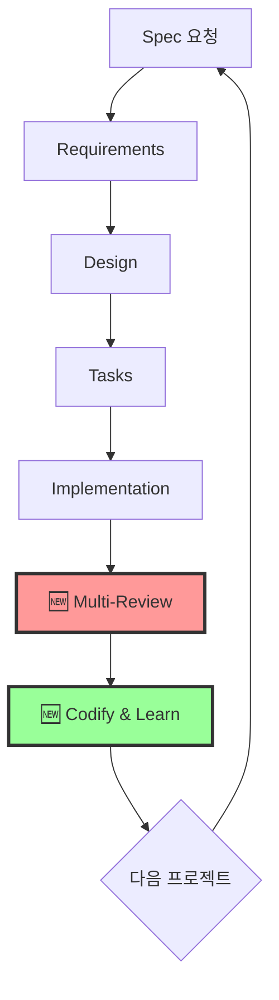
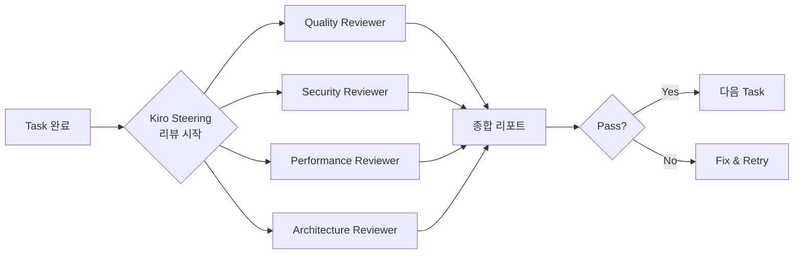
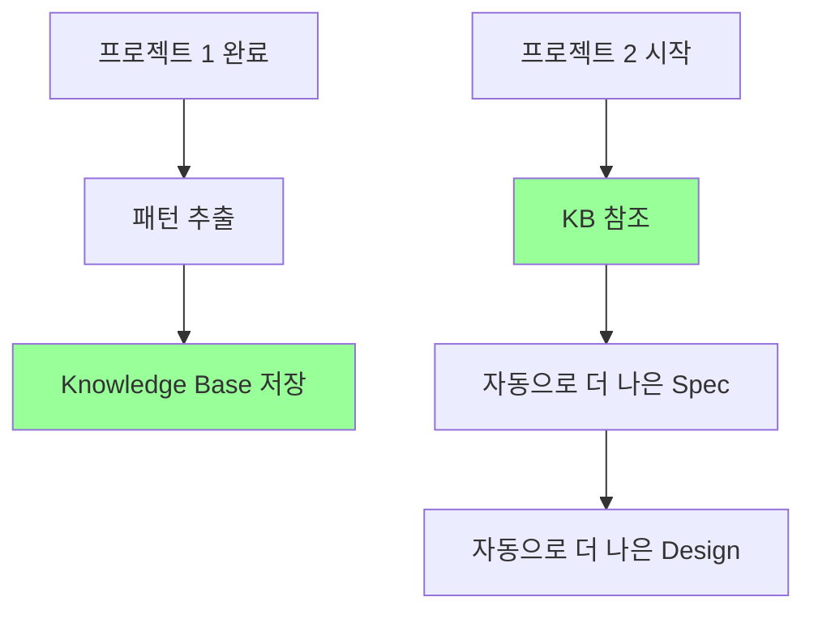
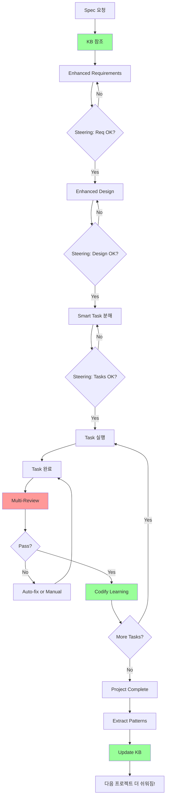

# Compounding Engineering을 Kiro IDE에 적용하는 방법 🚀

## 🎯 핵심 아이디어: Kiro + Compounding의 시너지



---

## 📊 현재 Kiro vs 개선된 Kiro 비교

| 단계 | 현재 Kiro | Compounding Kiro |
|------|----------|------------------|
| 1. Plan | Spec → Req → Design | ✅ 동일 + **패턴 DB 참조** |
| 2. Delegate | Task 분해 → 실행 | ✅ 동일 |
| 3. Assess | ❌ 없음 | **🆕 Multi-Agent Review** |
| 4. Codify | ❌ 없음 | **🆕 Learning System** |

---

## 💎 제안 1: Assess Layer 추가 (가장 중요!)

### 개념: Task 완료 후 멀티 리뷰어 검증



### 구현 방법

```typescript
// kiro.config.ts
export const kiroConfig = {
  hooks: {
    // Task 완료 후 자동 리뷰
    afterTaskComplete: async (task: Task) => {
      const reviews = await runMultiReview(task);
      
      if (!reviews.allPass) {
        return {
          status: 'needs_revision',
          feedback: reviews.issues,
          autoFix: reviews.autoFixable
        };
      }
      
      // 학습 시스템에 기록
      await codifyLearnings(task, reviews);
      
      return { status: 'approved' };
    }
  }
};

// 멀티 리뷰어 실행
async function runMultiReview(task: Task) {
  const reviewers = [
    new QualityReviewer(),      // 코드 품질
    new SecurityReviewer(),     // 보안
    new PerformanceReviewer(),  // 성능
    new ArchitectureReviewer()  // 아키텍처
  ];
  
  // 병렬 실행
  const results = await Promise.all(
    reviewers.map(r => r.review(task))
  );
  
  return {
    allPass: results.every(r => r.pass),
    issues: results.flatMap(r => r.issues),
    autoFixable: results.filter(r => r.autoFix)
  };
}
```

---

## 💎 제안 2: Codify Layer 추가 (복리 효과의 핵심!)

### 개념: 프로젝트마다 학습한 내용을 다음에 자동 적용



### 구현: Kiro Learning System

```typescript
// kiro-learning.ts
interface ProjectLearning {
  projectId: string;
  timestamp: Date;
  
  // 패턴들
  patterns: {
    requirements: RequirementPattern[];  // 자주 쓰는 요구사항
    designs: DesignPattern[];            // 자주 쓰는 설계
    tasks: TaskPattern[];                // 자주 쓰는 Task 구조
    issues: IssuePattern[];              // 자주 발생하는 문제
  };
  
  // 개선사항
  improvements: {
    whatWentWell: string[];
    whatWentWrong: string[];
    nextTimeDoBetter: string[];
  };
}

// Hook: 프로젝트 완료 시
export const afterProjectComplete = async (project: Project) => {
  // 1. 패턴 추출
  const patterns = await extractPatterns(project);
  
  // 2. 개선사항 분석
  const improvements = await analyzeImprovements(project);
  
  // 3. Knowledge Base에 저장
  await knowledgeBase.store({
    projectId: project.id,
    patterns,
    improvements,
    timestamp: new Date()
  });
  
  // 4. 다음 프로젝트 템플릿 업데이트
  await updateProjectTemplates(patterns);
};

// Hook: 새 프로젝트 시작 시
export const beforeProjectStart = async (spec: Spec) => {
  // 유사한 과거 프로젝트 찾기
  const similarProjects = await knowledgeBase.findSimilar(spec);
  
  // 학습한 패턴 자동 적용
  const enhancedSpec = await applyLearnings(spec, similarProjects);
  
  return enhancedSpec;
};
```

---

## 💎 제안 3: Kiro Steering - 중간 검증 포인트

### 개념: 큰 결정 전에 멈춰서 확인

```typescript
// kiro-steering.ts
export const steeringPoints = {
  // Requirements 완성 후
  afterRequirements: async (req: Requirements) => {
    console.log("📋 Requirements 검토 포인트");
    
    // 자동 체크리스트
    const checks = await validateRequirements(req);
    
    // 유사 프로젝트 참조
    const similar = await findSimilarProjects(req);
    
    return {
      autoChecks: checks,
      suggestions: similar.map(p => p.learnings),
      userConfirmNeeded: !checks.allPass
    };
  },
  
  // Design 완성 후
  afterDesign: async (design: Design) => {
    console.log("🏗️ Design 검토 포인트");
    
    // 아키텍처 리뷰
    const archReview = await reviewArchitecture(design);
    
    // 보안 사전 체크
    const securityCheck = await preCheckSecurity(design);
    
    return {
      architectureIssues: archReview.issues,
      securityRisks: securityCheck.risks,
      userConfirmNeeded: archReview.hasIssues || securityCheck.hasRisks
    };
  },
  
  // Task 분해 후
  afterTaskBreakdown: async (tasks: Task[]) => {
    console.log("📝 Task 분해 검토 포인트");
    
    // 의존성 체크
    const depCheck = await analyzeDependencies(tasks);
    
    // 작업량 추정
    const estimate = await estimateEffort(tasks);
    
    return {
      dependencies: depCheck.graph,
      parallelizable: depCheck.parallel,
      estimatedTime: estimate,
      userConfirmNeeded: depCheck.hasCircular || estimate > threshold
    };
  }
};
```

---

## 💎 제안 4: Kiro Hook - 자동화 레이어

### 개념: 반복 작업을 자동화

```typescript
// kiro-hooks.ts
export const kiroHooks = {
  // 🎯 자동 보안 스캔
  beforeTaskExecution: async (task: Task) => {
    if (task.type === 'authentication' || task.type === 'api') {
      console.log("🔒 보안 사전 체크 실행...");
      const securityGuidelines = await getSecurityGuidelines(task.type);
      task.constraints.push(...securityGuidelines);
    }
  },
  
  // 🎯 자동 테스트 생성
  afterTaskComplete: async (task: Task) => {
    console.log("🧪 테스트 자동 생성...");
    const tests = await generateTests(task);
    await saveTests(tests);
  },
  
  // 🎯 자동 문서화
  afterAllTasksComplete: async (project: Project) => {
    console.log("📚 문서 자동 생성...");
    
    const docs = {
      readme: await generateReadme(project),
      api: await generateApiDocs(project),
      architecture: await generateArchDiagram(project)
    };
    
    await saveDocs(docs);
  },
  
  // 🎯 자동 패턴 학습
  afterProjectComplete: async (project: Project) => {
    console.log("🧠 학습 데이터 추출...");
    
    // 이번 프로젝트에서 배운 것들
    const learnings = await extractLearnings(project);
    
    // Knowledge Base 업데이트
    await updateKnowledgeBase(learnings);
    
    // 다음 프로젝트 템플릿 개선
    await improveTemplates(learnings);
  }
};
```

---

## 💎 제안 5: Knowledge Base 시스템

### 개념: 팀 전체의 지식을 축적

```typescript
// knowledge-base.ts
class KiroKnowledgeBase {
  // 프로젝트 완료 시 학습
  async learn(project: Project) {
    // 1. 성공한 패턴 추출
    const successPatterns = await this.extractSuccessPatterns(project);
    
    // 2. 실패한 패턴 추출
    const failurePatterns = await this.extractFailurePatterns(project);
    
    // 3. 저장
    await this.store({
      success: successPatterns,
      failure: failurePatterns,
      context: project.domain,
      timestamp: new Date()
    });
  }
  
  // 새 프로젝트 시작 시 적용
  async apply(spec: Spec): Promise<EnhancedSpec> {
    // 1. 유사 도메인 프로젝트 찾기
    const similar = await this.findSimilar(spec.domain);
    
    // 2. 성공 패턴 적용
    const enhanced = await this.applySuccessPatterns(spec, similar);
    
    // 3. 실패 패턴 회피
    const safe = await this.avoidFailurePatterns(enhanced, similar);
    
    return safe;
  }
  
  // 실시간 조언
  async getSuggestions(currentTask: Task): Promise<Suggestion[]> {
    // 비슷한 Task에서 발생했던 문제들
    const commonIssues = await this.findCommonIssues(currentTask.type);
    
    // 추천 솔루션
    const solutions = await this.findSolutions(commonIssues);
    
    return solutions.map(s => ({
      issue: s.issue,
      solution: s.solution,
      confidence: s.confidence,
      source: s.pastProjects
    }));
  }
}
```

---

## 🎨 제안 6: 완전한 워크플로우 통합

### Kiro Compounding Workflow



---

## 🚀 구현 로드맵

### Phase 1: Quick Wins (1-2주)

```typescript
// 1. 간단한 Hook 추가
export const quickHooks = {
  // 완료 후 체크리스트
  afterTaskComplete: async (task) => {
    const checklist = [
      "테스트 작성됨?",
      "보안 체크 완료?",
      "문서 업데이트됨?",
      "성능 테스트 완료?"
    ];
    
    return await validateChecklist(task, checklist);
  }
};

// 2. 간단한 리뷰어
class SimpleQualityReviewer {
  async review(task: Task) {
    return {
      codeComplexity: await analyzeComplexity(task.code),
      testCoverage: await checkCoverage(task.tests),
      issues: await findCommonIssues(task)
    };
  }
}
```

### Phase 2: Learning System (2-4주)

```typescript
// 1. 간단한 Knowledge Base
class SimpleKB {
  private storage = new Map<string, Learning>();
  
  async store(learning: Learning) {
    this.storage.set(learning.id, learning);
  }
  
  async findSimilar(spec: Spec) {
    // 간단한 키워드 매칭
    return Array.from(this.storage.values())
      .filter(l => hasCommonKeywords(l, spec))
      .sort((a, b) => similarity(b, spec) - similarity(a, spec));
  }
}

// 2. 프로젝트 완료 시 학습
afterProjectComplete: async (project) => {
  const learning = {
    id: project.id,
    keywords: extractKeywords(project),
    patterns: extractPatterns(project),
    issues: project.issues,
    solutions: project.solutions
  };
  
  await kb.store(learning);
}
```

### Phase 3: Advanced Features (1-2개월)

```typescript
// 1. AI 기반 패턴 인식
class AIPatternRecognizer {
  async analyze(projects: Project[]) {
    // 머신러닝으로 패턴 학습
    const patterns = await mlModel.findPatterns(projects);
    
    return {
      frequentRequirements: patterns.requirements,
      commonArchitectures: patterns.architectures,
      typicalIssues: patterns.issues,
      bestSolutions: patterns.solutions
    };
  }
}

// 2. 예측 시스템
class PredictiveSystem {
  async predict(spec: Spec) {
    return {
      estimatedTime: await predictTime(spec),
      potentialIssues: await predictIssues(spec),
      recommendedArchitecture: await recommendArch(spec),
      successProbability: await predictSuccess(spec)
    };
  }
}
```

---

## 💡 실전 예제: 사용자 인증 시스템

### Before (현재 Kiro)

```
1. Spec: "사용자 인증 시스템 만들기"
2. Requirements 생성
3. Design 생성
4. Tasks 분해
5. 실행
6. 완료
```

### After (Compounding Kiro)

```typescript
// 1. Spec + KB 참조
spec: "사용자 인증 시스템"

kb.findSimilar() → 
  "이전에 3개 인증 시스템 만들었음"
  "자주 발생한 이슈: CSRF, SQL Injection, Rate Limiting"
  "추천 아키텍처: JWT + OAuth2"

// 2. Enhanced Requirements
requirements: {
  기본: ["회원가입", "로그인", "로그아웃"],
  보안: ["CSRF 보호", "Rate Limiting", "2FA"],  // ← 자동 추가!
  테스트: ["단위 테스트", "통합 테스트"]        // ← 자동 추가!
}

// 3. Steering Check
steering.afterRequirements() →
  "✅ 보안 요구사항 포함됨"
  "⚠️ 비밀번호 정책 명시 필요"
  
// 4. Enhanced Design
design: {
  architecture: "JWT + OAuth2",  // ← KB에서 추천
  security: [                    // ← 과거 이슈에서 학습
    "bcrypt for passwords",
    "HTTPS only",
    "Secure cookies"
  ]
}

// 5. Steering Check
steering.afterDesign() →
  "✅ 아키텍처 검증 완료"
  "✅ 보안 체크 통과"

// 6. Smart Task 분해
tasks: [
  {
    id: 1,
    name: "User Model",
    hints: [  // ← KB에서 자동 추가
      "remember to hash password",
      "add email uniqueness constraint"
    ]
  },
  {
    id: 2,
    name: "Auth Controller",
    securityChecks: [  // ← 자동 추가
      "CSRF token validation",
      "Rate limiting"
    ]
  }
]

// 7. Task 실행 + Review
task1.complete() →
  multiReview() →
    securityReviewer: "⚠️ Missing rate limiting"
    performanceReviewer: "✅ Looks good"
    
// 8. Auto-fix 또는 Manual fix
autoFix(rateLimiting) →
  "✅ Rate limiting added"

// 9. Codify
codifyLearning() →
  "인증 시스템에서 Rate Limiting 필수임을 학습"
  "다음 프로젝트에서 자동 적용될 것"

// 10. Project Complete
extractPatterns() →
  "이 아키텍처가 잘 작동함"
  "이 테스트 구조가 좋았음"
  "다음엔 2FA를 처음부터 고려하자"

// 복리 효과!
// 다음 인증 시스템은 이 모든 게 자동으로 적용됨
```

---

## 🎯 핵심 메트릭: 복리 효과 측정

```typescript
interface CompoundingMetrics {
  // 프로젝트 1
  project1: {
    setupTime: "2 hours",
    issuesFound: 15,
    timeToFix: "8 hours",
    totalTime: "40 hours"
  },
  
  // 프로젝트 2 (학습 적용)
  project2: {
    setupTime: "30 minutes",     // ↓ 75%
    issuesFound: 8,               // ↓ 47%
    timeToFix: "3 hours",         // ↓ 62%
    totalTime: "28 hours"         // ↓ 30%
  },
  
  // 프로젝트 3 (더 많은 학습)
  project3: {
    setupTime: "15 minutes",      // ↓ 87%
    issuesFound: 3,               // ↓ 80%
    timeToFix: "1 hour",          // ↓ 87%
    totalTime: "20 hours"         // ↓ 50%
  }
}
```

---

## 🛠️ 즉시 시작할 수 있는 것들

### 1. 간단한 Checklist Hook

```typescript
// kiro.config.ts에 추가
export default {
  hooks: {
    afterTaskComplete: async (task) => {
      console.log("✅ Task 완료 체크리스트:");
      console.log("□ 테스트 작성됨?");
      console.log("□ 보안 체크 완료?");
      console.log("□ 문서 업데이트?");
      console.log("□ 성능 테스트?");
      
      // 사용자 확인 대기
      const confirmed = await waitForUserConfirm();
      return confirmed;
    }
  }
};
```

### 2. 간단한 학습 파일

```typescript
// learnings.json
{
  "auth_systems": {
    "common_issues": [
      "Missing CSRF protection",
      "No rate limiting",
      "Weak password policy"
    ],
    "best_practices": [
      "Use bcrypt for passwords",
      "Implement 2FA",
      "Use HTTPS only"
    ],
    "recommended_architecture": "JWT + OAuth2"
  }
}

// Spec 생성 시 참조
beforeSpecGeneration: async (input) => {
  if (input.includes("auth")) {
    const learnings = await loadLearnings("auth_systems");
    return enhanceSpec(input, learnings);
  }
}
```

### 3. 간단한 리뷰 스크립트

```typescript
// post-task-review.ts
export async function reviewTask(task: Task) {
  const issues = [];
  
  // 보안 체크
  if (task.code.includes("password") && !task.code.includes("bcrypt")) {
    issues.push("⚠️ Password not hashed with bcrypt");
  }
  
  // 테스트 체크
  if (!task.tests || task.tests.length === 0) {
    issues.push("⚠️ No tests found");
  }
  
  // 문서 체크
  if (!task.documentation) {
    issues.push("⚠️ No documentation");
  }
  
  return {
    pass: issues.length === 0,
    issues
  };
}
```

---

## 🎉 최종 제안

### Kiro Compounding Edition 기능 요약

```yaml
1. Assess Layer (멀티 리뷰):
   - Quality Reviewer
   - Security Reviewer
   - Performance Reviewer
   - Architecture Reviewer
   
2. Codify Layer (학습 시스템):
   - Knowledge Base
   - Pattern Recognition
   - Auto-Enhancement
   
3. Steering (검증 포인트):
   - After Requirements
   - After Design
   - After Task Breakdown
   
4. Hooks (자동화):
   - Auto Security Check
   - Auto Test Generation
   - Auto Documentation
   - Auto Pattern Learning
   
5. Complexity (복리 효과):
   - 프로젝트마다 더 빨라짐
   - 이슈가 줄어듦
   - 품질이 올라감
   - 팀 지식이 쌓임
```

---

**시작 순서 추천:**

```
Week 1: Checklist Hook 추가
Week 2: 간단한 리뷰어 추가
Week 3: 학습 파일 시스템
Week 4: Steering 포인트 추가
Week 5-8: Knowledge Base 구축
Week 9-12: AI 기반 패턴 인식
```

**핵심 메시지:**
> "매번 프로젝트가 이전보다 30-50% 더 빠르고 쉬워진다면?"
> 
> 이게 Compounding Engineering의 약속입니다! 🚀

더 구체적인 구현 방법이나 특정 부분에 대해 더 알고 싶으신가요?