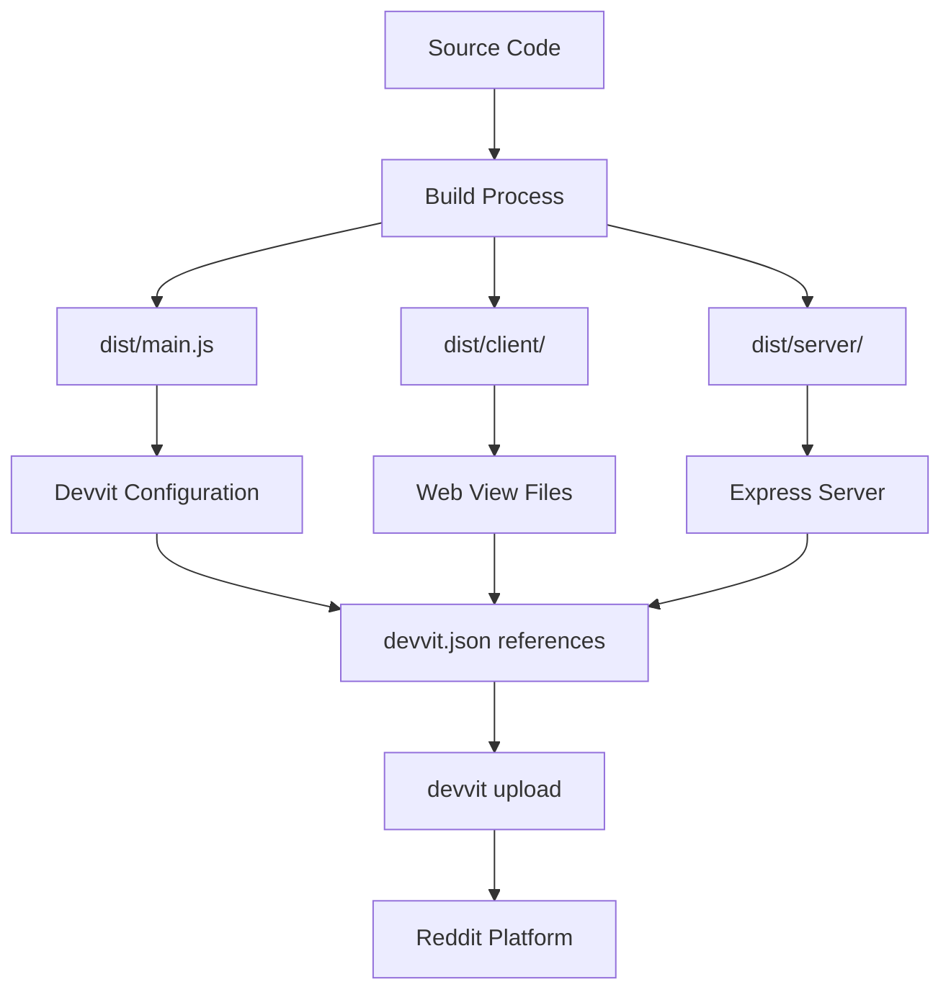

# Lessons Learned: devvit.json 설정 오류 분석

**날짜**: 2025-10-27
**프로젝트**: Armchair Sleuths
**심각도**: P1 (Critical - 포스트 생성 불가)
**해결 시간**: ~2시간
**문서 작성자**: Development Team

---

## Executive Summary

### 문제 개요
Reddit 게임 포스트 생성 시 `Error: missing "default" in 'devvit.json' 'post.entrypoints'` 에러가 발생하여 핵심 기능이 완전히 차단되었습니다.

### 근본 원인
devvit.json 설정 파일의 구조가 Devvit 공식 스키마와 일치하지 않았습니다. 특히 `post.entrypoints` 섹션이 잘못 구성되어 있었습니다.

### 핵심 교훈
1. **문서 우선 (Documentation First)**: 에러 발생 시 추측보다 공식 문서를 먼저 확인
2. **백업 활용**: 과거에 작동했던 설정(백업)이 정답을 담고 있을 수 있음
3. **에러 메시지 정확한 해석**: 에러 메시지가 정확한 경로를 알려주고 있었음
4. **설정 검증 자동화**: 설정 파일 변경 시 자동 검증 프로세스 필요

### 영향 범위
- **개발 시간 손실**: ~2시간
- **기능 차단**: 포스트 생성 완전 불가
- **사용자 영향**: 개발 환경에만 국한 (프로덕션 배포 전 발견)

---

## Timeline: 문제 발생부터 해결까지

### 🔴 Phase 1: 문제 발견 (T+0)
```
[DEVVIT] ❌ Failed to create post: Error: missing "default" in `devvit.json` `post.entrypoints`
```

**발생 상황**:
- 케이스 생성 성공 (스토리, 이미지, KV 저장 모두 정상)
- Reddit API 호출 실패 (`reddit.submitCustomPost()`)
- 게임 로직은 완벽하게 작동하나 포스트 생성만 실패

**초기 가설**:
- Reddit API 권한 문제?
- devvit.json 설정 누락?

### 🟡 Phase 2: 첫 번째 수정 시도 (T+30분)

**시도한 수정**:
```json
// ❌ 잘못된 수정
"posts": {
  "default": {
    "entry": "dist/main.js"
  }
}
```

**결과**: 동일한 에러 지속

**문제점**:
- `posts` (복수형) 사용 - 스키마는 `post` (단수형) 요구
- `entrypoints` 레이어 누락
- 잘못된 엔트리 포인트 (main.js 대신 index.html)

### 🟢 Phase 3: 근본 원인 파악 (T+60분)

**수행한 조사**:
1. 공식 Devvit 문서 검색
2. 프로젝트 내 백업 파일 발견 (`devvit.json.backup`)
3. 빌드 산출물 구조 분석 (`dist/` 디렉토리)

**발견 사항**:
- 백업 파일에 올바른 구조가 있었음
- 공식 문서가 정확한 스키마를 명시
- 에러 메시지가 정확한 경로를 알려주고 있었음: `post.entrypoints.default`

### ✅ Phase 4: 올바른 수정 적용 (T+90분)

**적용한 수정**:
```json
// ✅ 올바른 구조
"post": {
  "dir": "dist/client",
  "entrypoints": {
    "default": {
      "entry": "index.html"
    }
  }
}
```

**결과**: 포스트 생성 성공

---

## Root Cause Analysis: 5 Whys

### Why 1: 왜 포스트 생성이 실패했는가?
**답변**: devvit.json의 `post.entrypoints.default` 설정이 없었기 때문

### Why 2: 왜 해당 설정이 없었는가?
**답변**: 이전에 설정을 변경하면서 잘못된 구조로 수정했기 때문

### Why 3: 왜 잘못된 구조로 수정했는가?
**답변**: 공식 문서를 확인하지 않고 추측으로 설정했기 때문

### Why 4: 왜 공식 문서를 확인하지 않았는가?
**답변**: 설정 파일 변경 시 검증 프로세스가 없었기 때문

### Why 5: 왜 검증 프로세스가 없었는가?
**답변**:
- 설정 파일의 중요성에 대한 인식 부족
- 자동화된 검증 도구 미구축
- 설정 변경에 대한 표준 프로세스 부재

### 근본 원인 (Root Cause)
**설정 관리 프로세스의 부재**: 설정 파일 변경 시 검증, 문서화, 리뷰 프로세스가 없어 잘못된 설정이 반영됨

---

## 구조 분석: 올바른 vs 잘못된 설정

### ❌ 잘못된 구조 (문제 발생)

```json
{
  "posts": {              // ❌ 복수형 (잘못됨)
    "default": {          // ❌ entrypoints 레이어 누락
      "entry": "dist/main.js"  // ❌ 잘못된 엔트리 포인트
    }
  }
}
```

**문제점**:
1. **`posts` vs `post`**: Devvit 스키마는 단수형 `post` 요구
2. **레이어 구조**: `entrypoints` 객체가 중간에 필요
3. **엔트리 포인트**: 웹뷰 HTML 파일이어야 하는데 JS 파일 지정
4. **경로 불일치**: `dist/main.js`는 Devvit 설정 번들이지 웹뷰가 아님

### ✅ 올바른 구조 (해결)

```json
{
  "post": {               // ✅ 단수형
    "dir": "dist/client",  // ✅ 웹뷰 베이스 디렉토리
    "entrypoints": {      // ✅ entrypoints 레이어
      "default": {        // ✅ 기본 엔트리 포인트
        "entry": "index.html"  // ✅ 웹뷰 HTML 파일
      }
    }
  }
}
```

**올바른 이유**:
1. **정확한 키**: `post` (단수형) - Devvit 스키마 준수
2. **완전한 구조**: `post.entrypoints.default` 경로 완성
3. **올바른 타겟**: `index.html` - 실제 웹뷰 파일
4. **상대 경로**: `dir` + `entry` = `dist/client/index.html` (존재하는 파일)

---

## 아키텍처 이해: Devvit의 Dual-Context 구조

### Devvit 앱의 두 가지 컨텍스트

```
┌─────────────────────────────────────────────────────────────┐
│                    Devvit Application                       │
├─────────────────────────────┬───────────────────────────────┤
│    Context 1: Custom Post   │   Context 2: Express Server   │
│         (main.tsx)          │      (server/index.ts)        │
├─────────────────────────────┼───────────────────────────────┤
│                             │                               │
│  • Devvit.configure()       │  • Express routes            │
│  • Devvit.addCustomPostType │  • Menu action handlers      │
│  • Custom Post UI           │  • API endpoints             │
│  • Scheduler jobs           │  • Business logic            │
│                             │                               │
│  Build → dist/main.js       │  Build → dist/server/        │
│                             │          index.cjs            │
│                             │                               │
│  웹뷰 Build →               │                               │
│  dist/client/               │                               │
│  ├── index.html ✅          │                               │
│  ├── index.js               │                               │
│  └── index.css              │                               │
└─────────────────────────────┴───────────────────────────────┘
```

### devvit.json이 각 컨텍스트를 어떻게 연결하는가

```json
{
  "post": {
    "dir": "dist/client",          // 웹뷰 파일들의 위치
    "entrypoints": {
      "default": {
        "entry": "index.html"      // 사용자에게 보여질 HTML
      }
    }
  },
  "server": {
    "dir": "dist/server",          // Express 서버 위치
    "entry": "index.cjs"           // 서버 엔트리 포인트
  }
}
```

### 빌드 프로세스 흐름

```
소스 코드                    빌드 도구              산출물
──────────────────────────────────────────────────────────────
src/main.tsx            →   vite (main)    →   dist/main.js
                                                 (Devvit 설정)

src/client/**/*.tsx     →   vite (client)  →   dist/client/
                                                 ├── index.html
                                                 ├── index.js
                                                 └── index.css

src/server/**/*.ts      →   vite (server)  →   dist/server/
                                                 └── index.cjs
```

### 포스트 생성 시 흐름

```
1. Menu Action Click
   └─→ /internal/menu/post-create (Express server)

2. Case Generation
   └─→ CaseGeneratorService.generateCase()
       └─→ Story, Images, KV Storage ✅

3. Reddit Post Creation
   └─→ reddit.submitCustomPost()
       └─→ Devvit가 post.entrypoints.default 검색
           └─→ dist/client/index.html 로드
               └─→ Custom Post 생성 ✅
```

**핵심**: `post.entrypoints.default`가 없으면 3번 단계에서 실패합니다!

---

## Lessons Learned: 구체적이고 실행 가능한 교훈

### 🎯 Lesson 1: 문서 우선 접근 (Documentation First)

**문제**: 에러 발생 시 추측으로 문제 해결 시도

**올바른 접근**:
1. ✅ 에러 메시지 정확히 읽기
2. ✅ 공식 문서 확인 (https://developers.reddit.com/docs/)
3. ✅ 백업/히스토리 확인
4. ✅ 커뮤니티/이슈 검색
5. ❌ 추측 기반 수정 (최후의 수단)

**실행 방안**:
```bash
# 에러 발생 시 체크리스트
□ 에러 메시지를 정확히 읽고 키워드 식별
□ 공식 문서에서 해당 키워드 검색
□ 프로젝트 내 backup 파일 확인
□ Git history에서 최근 변경사항 확인
□ 관련 GitHub Issues 검색
```

### 🎯 Lesson 2: 에러 메시지의 정확한 해석

**문제**: 에러 메시지가 정확한 경로를 알려줬지만 무시함

**에러 메시지 분석**:
```
Error: missing "default" in `devvit.json` `post.entrypoints`
           ↓         ↓              ↓           ↓
        찾는 값   어디서?      어떤 파일?    어느 경로?
```

**올바른 해석**:
```
devvit.json 파일의
  post 섹션의
    entrypoints 객체 안에
      "default" 키가 필요함
```

**실행 방안**:
- 에러 메시지를 literal하게 읽는 훈련
- 경로를 역순으로 추적: `post.entrypoints.default`
- 에러 메시지에 나온 정확한 키워드 사용

### 🎯 Lesson 3: 백업과 히스토리의 가치

**발견**: `devvit.json.backup` 파일에 정답이 있었음

**문제**: 처음에 백업 파일을 확인하지 않음

**실행 방안**:
```bash
# 문제 발생 시 즉시 실행할 명령어들
git log -p devvit.json          # 설정 변경 히스토리
git diff HEAD~1 devvit.json    # 최근 변경사항
ls *.backup                     # 백업 파일 확인
```

**백업 전략 수립**:
```json
// devvit.json 변경 전
cp devvit.json devvit.json.backup-$(date +%Y%m%d-%H%M%S)

// 작동 확인 후
git add devvit.json
git commit -m "fix: correct post.entrypoints structure"
```

### 🎯 Lesson 4: 설정 파일 검증 자동화

**문제**: 설정 변경 후 검증 없이 배포

**해결책**: JSON Schema 검증 자동화

**Implementation**:

#### 1. Schema 검증 스크립트 생성

```javascript
// scripts/validate-devvit-config.js
const Ajv = require('ajv');
const fs = require('fs');

const ajv = new Ajv();
const devvitConfig = JSON.parse(fs.readFileSync('devvit.json', 'utf8'));

// Devvit 스키마 로드 (또는 자체 스키마 정의)
const schema = {
  type: 'object',
  required: ['name'],
  properties: {
    name: { type: 'string' },
    post: {
      type: 'object',
      properties: {
        dir: { type: 'string' },
        entrypoints: {
          type: 'object',
          required: ['default'],
          properties: {
            default: {
              type: 'object',
              required: ['entry'],
              properties: {
                entry: { type: 'string' }
              }
            }
          }
        }
      }
    },
    server: {
      type: 'object',
      required: ['dir', 'entry']
    }
  }
};

const validate = ajv.compile(schema);
const valid = validate(devvitConfig);

if (!valid) {
  console.error('❌ devvit.json validation failed:');
  console.error(validate.errors);
  process.exit(1);
}

console.log('✅ devvit.json is valid');
```

#### 2. Pre-commit Hook 설정

```bash
# .husky/pre-commit
#!/bin/sh
. "$(dirname "$0")/_/husky.sh"

echo "🔍 Validating devvit.json..."
node scripts/validate-devvit-config.js

if [ $? -ne 0 ]; then
  echo "❌ devvit.json validation failed. Commit aborted."
  exit 1
fi

echo "✅ devvit.json validation passed"
```

#### 3. Package.json 스크립트 추가

```json
{
  "scripts": {
    "validate:config": "node scripts/validate-devvit-config.js",
    "prebuild": "npm run validate:config",
    "preupload": "npm run validate:config"
  }
}
```

### 🎯 Lesson 5: 설정 파일 문서화

**문제**: devvit.json에 주석이 없어 각 설정의 의미를 파악하기 어려움

**해결책**: 자체 설정 문서 작성

**파일 생성**: `docs/DEVVIT_CONFIGURATION.md`

```markdown
# Devvit Configuration Guide

## post 섹션
웹뷰 Custom Post 설정

### post.dir
- **값**: `dist/client`
- **설명**: 웹뷰 파일들이 위치한 디렉토리
- **빌드**: `npm run build:client`로 생성
- **중요**: 이 경로는 vite.client.config.ts의 output과 일치해야 함

### post.entrypoints.default.entry
- **값**: `index.html`
- **설명**: 사용자에게 보여질 웹뷰의 진입점
- **전체 경로**: `{post.dir}/{entry}` = `dist/client/index.html`
- **중요**: 이 파일이 반드시 존재해야 함

## 검증 방법
\`\`\`bash
# 설정 파일 검증
npm run validate:config

# 빌드 산출물 확인
ls dist/client/index.html  # 이 파일이 존재해야 함
\`\`\`
```

### 🎯 Lesson 6: 아키텍처 이해의 중요성

**문제**: Devvit의 dual-context 구조를 이해하지 못해 잘못된 설정 적용

**해결책**: 아키텍처 다이어그램 문서화

**파일 생성**: `docs/ARCHITECTURE.md`

```markdown
# Armchair Sleuths Architecture

## Devvit Dual-Context Architecture

### Context 1: Custom Post (main.tsx)
- **목적**: Devvit 앱 설정 및 Custom Post 타입 정의
- **빌드**: vite.main.config.ts → dist/main.js
- **내용**:
  - Devvit.configure()
  - Devvit.addCustomPostType()
  - Scheduler 정의

### Context 2: Express Server (server/index.ts)
- **목적**: API 엔드포인트 및 비즈니스 로직
- **빌드**: vite.server.config.ts → dist/server/index.cjs
- **내용**:
  - Express routes
  - Menu action handlers
  - KV Store 로직

### Context 3: Web View (client/App.tsx)
- **목적**: 사용자에게 보여질 React UI
- **빌드**: vite.client.config.ts → dist/client/
- **내용**:
  - React 컴포넌트
  - 게임 UI
  - 클라이언트 로직

## 설정 파일 매핑

| 설정 | 빌드 설정 | 산출물 | devvit.json 매핑 |
|------|-----------|--------|------------------|
| main.tsx | vite.main.config.ts | dist/main.js | (자동 로드) |
| server/ | vite.server.config.ts | dist/server/index.cjs | server.entry |
| client/ | vite.client.config.ts | dist/client/index.html | post.entrypoints.default.entry |
```

---

## Action Items: 즉시 실행할 것들

### ✅ 우선순위 1: 즉시 실행 (오늘)

#### 1. devvit.json에 인라인 주석 추가
```json
{
  // 각 섹션의 목적과 주의사항을 주석으로 추가
  // (JSON은 주석을 지원하지 않으므로 별도 README 작성)
}
```

**대안**: `devvit.json.md` 파일 생성
```markdown
# devvit.json 설명

## post 섹션
...설명...

## 주의사항
- post.entrypoints.default.entry는 반드시 dist/client/ 아래에 존재해야 함
- 변경 후 npm run build:client 실행 필수
```

#### 2. 현재 작동하는 설정 명시적으로 commit
```bash
git add devvit.json
git commit -m "docs: verified working devvit.json configuration

- post.entrypoints.default.entry: index.html (correct)
- Tested and confirmed post creation works
- Reference: LESSONS_LEARNED_devvit_json_configuration.md"
```

#### 3. Quick Reference 카드 생성
```markdown
# devvit.json Quick Reference

## 에러 발생 시 체크리스트
1. [ ] 공식 문서 확인
2. [ ] 백업 파일 확인 (*.backup)
3. [ ] Git diff 확인
4. [ ] 빌드 산출물 확인 (dist/ 디렉토리)
5. [ ] Schema 검증 실행

## 올바른 구조
\`\`\`json
{
  "post": {
    "dir": "dist/client",
    "entrypoints": {
      "default": {
        "entry": "index.html"
      }
    }
  }
}
\`\`\`

## 검증 명령어
\`\`\`bash
npm run validate:config
ls dist/client/index.html
devvit build
\`\`\`
```

### 🟡 우선순위 2: 단기 실행 (1주 내)

#### 1. 검증 스크립트 구현
- [ ] `scripts/validate-devvit-config.js` 작성
- [ ] JSON Schema 정의
- [ ] 빌드 산출물 검증 로직 추가

#### 2. Pre-commit Hook 설정
- [ ] Husky 설치: `npm install husky --save-dev`
- [ ] Pre-commit hook 생성
- [ ] devvit.json 변경 감지 시 자동 검증

#### 3. 문서 작성
- [ ] `docs/DEVVIT_CONFIGURATION.md`
- [ ] `docs/ARCHITECTURE.md`
- [ ] `docs/TROUBLESHOOTING.md`

#### 4. CI/CD 검증 추가
```yaml
# .github/workflows/validate.yml
name: Validate Configuration
on:
  pull_request:
    paths:
      - 'devvit.json'
      - 'vite.*.config.ts'

jobs:
  validate:
    runs-on: ubuntu-latest
    steps:
      - uses: actions/checkout@v3
      - uses: actions/setup-node@v3
      - run: npm ci
      - run: npm run validate:config
      - run: npm run build
      - name: Verify build outputs
        run: |
          test -f dist/client/index.html || exit 1
          test -f dist/server/index.cjs || exit 1
          test -f dist/main.js || exit 1
```

### 🟢 우선순위 3: 중장기 실행 (1개월 내)

#### 1. Configuration Management 시스템 구축
- [ ] 환경별 설정 관리 (dev, staging, prod)
- [ ] 설정 변경 히스토리 자동 추적
- [ ] 롤백 프로세스 정립

#### 2. Monitoring & Alerting
- [ ] 설정 변경 시 Slack 알림
- [ ] 빌드 실패 시 즉시 알림
- [ ] 주요 설정 변경은 팀 리뷰 필수

#### 3. Knowledge Base 구축
- [ ] 모든 에러와 해결 방법을 wiki에 문서화
- [ ] Troubleshooting 가이드 체계화
- [ ] 개발자 온보딩 자료에 포함

---

## Prevention Strategy: 재발 방지 전략

### 레이어 1: 코드 레벨 방어

#### 타입 안전성 확보
```typescript
// types/devvit-config.ts
export interface DevvitConfig {
  $schema: string;
  name: string;
  post: {
    dir: string;
    entrypoints: {
      default: {
        entry: string;
        height?: 'regular' | 'tall';
      };
    };
  };
  server: {
    dir: string;
    entry: string;
  };
  // ... 나머지 타입 정의
}

// 런타임 검증
import { DevvitConfig } from './types/devvit-config';
import devvitConfigJson from './devvit.json';

function validateConfig(config: unknown): asserts config is DevvitConfig {
  // 런타임 타입 체크
  if (!config || typeof config !== 'object') {
    throw new Error('Invalid config');
  }
  // ... 상세 검증
}

validateConfig(devvitConfigJson);
```

### 레이어 2: 빌드 레벨 방어

#### 빌드 스크립트에 검증 추가
```javascript
// scripts/build.js
const fs = require('fs');
const path = require('path');

function validateBuildOutputs() {
  const requiredFiles = [
    'dist/client/index.html',
    'dist/client/index.js',
    'dist/client/index.css',
    'dist/server/index.cjs',
    'dist/main.js'
  ];

  const missingFiles = requiredFiles.filter(file => !fs.existsSync(file));

  if (missingFiles.length > 0) {
    console.error('❌ Build validation failed. Missing files:');
    missingFiles.forEach(file => console.error(`  - ${file}`));
    process.exit(1);
  }

  // devvit.json 검증
  const devvitConfig = JSON.parse(fs.readFileSync('devvit.json', 'utf8'));
  const entryPath = path.join(
    devvitConfig.post.dir,
    devvitConfig.post.entrypoints.default.entry
  );

  if (!fs.existsSync(entryPath)) {
    console.error(`❌ Entry point does not exist: ${entryPath}`);
    process.exit(1);
  }

  console.log('✅ Build validation passed');
}

validateBuildOutputs();
```

```json
// package.json
{
  "scripts": {
    "build": "npm run build:all && node scripts/build.js",
    "build:all": "concurrently 'npm run build:client' 'npm run build:server' 'npm run build:main'"
  }
}
```

### 레이어 3: 배포 레벨 방어

#### Pre-upload 검증
```bash
# scripts/pre-upload.sh
#!/bin/bash

echo "🔍 Pre-upload validation..."

# 1. Config 검증
npm run validate:config
if [ $? -ne 0 ]; then
  echo "❌ Config validation failed"
  exit 1
fi

# 2. 빌드 검증
npm run build
if [ $? -ne 0 ]; then
  echo "❌ Build failed"
  exit 1
fi

# 3. 산출물 검증
test -f dist/client/index.html || { echo "❌ Missing index.html"; exit 1; }

# 4. Devvit 빌드 테스트
devvit build --dry-run
if [ $? -ne 0 ]; then
  echo "❌ Devvit build test failed"
  exit 1
fi

echo "✅ Pre-upload validation passed"
```

```json
// package.json
{
  "scripts": {
    "preupload": "bash scripts/pre-upload.sh",
    "upload": "devvit upload"
  }
}
```

### 레이어 4: 런타임 레벨 방어

#### 에러 핸들링 개선
```typescript
// src/server/core/post.ts
import { context, reddit } from '@devvit/web/server';

export async function createPost(payload: CreatePostPayload) {
  try {
    const result = await reddit.submitCustomPost(payload);
    console.log(`✅ Post created successfully: ${result.id}`);
    return result;
  } catch (error) {
    console.error('❌ Failed to create post:', error);

    // 구체적인 에러 처리
    if (error.message.includes('missing "default"')) {
      console.error(`
🔧 Configuration Error Detected

The error indicates a problem with devvit.json configuration.

Quick Fix:
1. Check devvit.json structure
2. Verify post.entrypoints.default exists
3. See docs/TROUBLESHOOTING.md for details

Reference: LESSONS_LEARNED_devvit_json_configuration.md
      `);
    }

    throw error;
  }
}
```

---

## Quick Reference: 다음에 같은 에러 발생 시

### 🚨 에러: `missing "default" in 'devvit.json' 'post.entrypoints'`

#### 즉시 실행할 명령어
```bash
# 1. 백업 확인
ls -la *.backup
cat devvit.json.backup  # 작동하던 설정 확인

# 2. 현재 구조 확인
cat devvit.json | grep -A 10 '"post"'

# 3. 빌드 산출물 확인
ls -la dist/client/
```

#### 올바른 구조 복사
```json
{
  "post": {
    "dir": "dist/client",
    "entrypoints": {
      "default": {
        "entry": "index.html"
      }
    }
  }
}
```

#### 검증 및 테스트
```bash
# 1. JSON 문법 검증
cat devvit.json | python -m json.tool

# 2. 빌드
npm run build

# 3. 업로드
devvit upload

# 4. 테스트
# - 브라우저에서 "Create a new post" 클릭
# - 로그에서 "✅ Post created successfully" 확인
```

---

## Related Resources

### 공식 문서
- [Devvit Configuration](https://developers.reddit.com/docs/capabilities/devvit-web/devvit_web_configuration)
- [Devvit Web Framework](https://developers.reddit.com/docs/capabilities/devvit-web/devvit_web_overview)
- [JSON Schema](https://developers.reddit.com/schema/config-file.v1.json)

### 프로젝트 문서
- `devvit.json.backup` - 작동하는 설정 백업
- `DEVVIT_CONFIG_FIX.md` - 이전 수정 시도 기록
- `ROOT_CAUSE_ANALYSIS_POST_CREATION_FAILURE.md` - 상세 분석

### 외부 리소스
- [Devvit GitHub Repo](https://github.com/reddit/devvit)
- [Devvit Community](https://reddit.com/r/devvit)
- [JSON Schema Validator](https://www.jsonschemavalidator.net/)

---

## Decision Tree: 에러 발생 시 의사결정 흐름

```
에러 발생
    │
    ├─→ 에러 메시지 읽기
    │   ├─→ 정확한 키워드 식별
    │   └─→ 경로 파악 (예: post.entrypoints.default)
    │
    ├─→ 공식 문서 확인
    │   ├─→ 해결책 발견? → 적용 → 테스트
    │   └─→ 해결책 없음? → 다음 단계
    │
    ├─→ 백업/히스토리 확인
    │   ├─→ 작동하던 설정 발견? → 복원 → 테스트
    │   └─→ 발견 못함? → 다음 단계
    │
    ├─→ 커뮤니티 검색
    │   ├─→ 유사 사례 발견? → 적용 → 테스트
    │   └─→ 발견 못함? → 다음 단계
    │
    ├─→ 디버깅
    │   ├─→ 로그 분석
    │   ├─→ 빌드 산출물 검증
    │   ├─→ 스키마 비교
    │   └─→ 가설 수립 및 테스트
    │
    └─→ 최후의 수단: Trial & Error
        └─→ 각 시도마다 백업 생성
```

---

## Validation Scripts

### 1. devvit.json 스키마 검증

```javascript
// scripts/validate-devvit-config.js
const fs = require('fs');
const path = require('path');

function validateDevvitConfig() {
  console.log('🔍 Validating devvit.json...\n');

  // 1. 파일 존재 확인
  if (!fs.existsSync('devvit.json')) {
    console.error('❌ devvit.json not found');
    return false;
  }

  // 2. JSON 파싱
  let config;
  try {
    config = JSON.parse(fs.readFileSync('devvit.json', 'utf8'));
  } catch (error) {
    console.error('❌ Invalid JSON syntax:', error.message);
    return false;
  }

  // 3. 필수 필드 검증
  const errors = [];

  if (!config.name) {
    errors.push('Missing required field: name');
  }

  if (!config.post) {
    errors.push('Missing required field: post');
  } else {
    if (!config.post.dir) {
      errors.push('Missing required field: post.dir');
    }
    if (!config.post.entrypoints) {
      errors.push('Missing required field: post.entrypoints');
    } else if (!config.post.entrypoints.default) {
      errors.push('Missing required field: post.entrypoints.default');
    } else if (!config.post.entrypoints.default.entry) {
      errors.push('Missing required field: post.entrypoints.default.entry');
    }
  }

  // 4. 빌드 산출물 검증
  if (config.post && config.post.dir && config.post.entrypoints?.default?.entry) {
    const entryPath = path.join(
      config.post.dir,
      config.post.entrypoints.default.entry
    );

    if (!fs.existsSync(entryPath)) {
      errors.push(`Entry point does not exist: ${entryPath}`);
      console.warn(`⚠️  Warning: Run 'npm run build:client' to create ${entryPath}`);
    }
  }

  // 5. 결과 출력
  if (errors.length > 0) {
    console.error('❌ Validation failed:\n');
    errors.forEach(error => console.error(`  - ${error}`));
    return false;
  }

  console.log('✅ devvit.json is valid\n');
  console.log('Configuration:');
  console.log(`  - name: ${config.name}`);
  console.log(`  - post.dir: ${config.post.dir}`);
  console.log(`  - post.entrypoints.default.entry: ${config.post.entrypoints.default.entry}`);

  return true;
}

// 스크립트로 실행될 때
if (require.main === module) {
  const isValid = validateDevvitConfig();
  process.exit(isValid ? 0 : 1);
}

module.exports = { validateDevvitConfig };
```

### 2. 빌드 산출물 검증

```javascript
// scripts/verify-build-outputs.js
const fs = require('fs');
const path = require('path');

function verifyBuildOutputs() {
  console.log('🔍 Verifying build outputs...\n');

  const requiredFiles = [
    { path: 'dist/client/index.html', description: 'Web view entry point' },
    { path: 'dist/client/index.js', description: 'Client JavaScript bundle' },
    { path: 'dist/client/index.css', description: 'Client styles' },
    { path: 'dist/server/index.cjs', description: 'Server bundle' },
    { path: 'dist/main.js', description: 'Devvit configuration bundle' }
  ];

  let allExist = true;

  requiredFiles.forEach(file => {
    const exists = fs.existsSync(file.path);
    const status = exists ? '✅' : '❌';
    const size = exists ? `${(fs.statSync(file.path).size / 1024).toFixed(2)} KB` : 'N/A';

    console.log(`${status} ${file.path.padEnd(30)} ${size.padStart(10)} - ${file.description}`);

    if (!exists) {
      allExist = false;
    }
  });

  console.log('');

  if (!allExist) {
    console.error('❌ Some build outputs are missing. Run: npm run build:all');
    return false;
  }

  console.log('✅ All build outputs verified');
  return true;
}

if (require.main === module) {
  const isValid = verifyBuildOutputs();
  process.exit(isValid ? 0 : 1);
}

module.exports = { verifyBuildOutputs };
```

### 3. 통합 검증 스크립트

```javascript
// scripts/validate-all.js
const { validateDevvitConfig } = require('./validate-devvit-config');
const { verifyBuildOutputs } = require('./verify-build-outputs');

async function validateAll() {
  console.log('🚀 Running all validations...\n');
  console.log('='.repeat(60));

  let allPassed = true;

  // 1. devvit.json 검증
  console.log('\n1️⃣  Validating devvit.json');
  console.log('-'.repeat(60));
  if (!validateDevvitConfig()) {
    allPassed = false;
  }

  // 2. 빌드 산출물 검증
  console.log('\n2️⃣  Verifying build outputs');
  console.log('-'.repeat(60));
  if (!verifyBuildOutputs()) {
    allPassed = false;
  }

  // 3. 최종 결과
  console.log('\n' + '='.repeat(60));
  if (allPassed) {
    console.log('✅ All validations passed!');
    console.log('\nYou can safely run: devvit upload');
  } else {
    console.log('❌ Some validations failed');
    console.log('\nPlease fix the errors above before uploading.');
  }
  console.log('='.repeat(60) + '\n');

  return allPassed;
}

if (require.main === module) {
  validateAll().then(isValid => process.exit(isValid ? 0 : 1));
}

module.exports = { validateAll };
```

---

## Conclusion

이 문서는 단순한 버그 리포트가 아니라 **시스템적 개선을 위한 로드맵**입니다.

### 핵심 메시지

1. **에러는 증상이고, 프로세스 부재가 원인입니다**
   - 이번 에러는 설정 오류였지만, 근본 원인은 검증 프로세스의 부재

2. **문서화는 미래의 나를 위한 투자입니다**
   - 작동하는 설정을 문서화하지 않으면 같은 실수 반복

3. **자동화는 인간의 실수를 방지합니다**
   - 수동 검증은 언젠가 실패함. 자동화가 답

4. **작은 개선의 누적이 큰 변화를 만듭니다**
   - 한 번에 완벽한 시스템을 구축할 수 없음
   - 각 문제마다 개선 사항을 추가

### 다음 단계

**즉시 (오늘)**:
- [ ] 이 문서를 팀과 공유
- [ ] Quick Reference 카드 프린트/북마크
- [ ] 현재 설정 명시적으로 commit

**이번 주**:
- [ ] 검증 스크립트 구현
- [ ] Pre-commit hook 설정
- [ ] 기본 문서 작성

**이번 달**:
- [ ] CI/CD 통합
- [ ] Knowledge base 구축
- [ ] 정기 리뷰 프로세스 확립

### 마지막 조언

> "같은 실수를 두 번 하는 것은 실수가 아니라 선택입니다."

이 문서를 통해 같은 문제가 다시 발생하지 않도록 시스템을 개선하세요.

---

**문서 버전**: 1.0
**최종 업데이트**: 2025-10-27
**작성자**: Development Team
**리뷰어**: [To be assigned]
**다음 리뷰 일정**: 2025-11-27

**관련 이슈**: #[issue-number]
**관련 PR**: #[pr-number]

---

## Appendix: 상세 기술 정보

### A. Devvit JSON Schema (Simplified)

```json
{
  "$schema": "http://json-schema.org/draft-07/schema#",
  "type": "object",
  "required": ["name"],
  "properties": {
    "name": {
      "type": "string",
      "pattern": "^[a-z][a-z0-9-]*$",
      "minLength": 3,
      "maxLength": 16
    },
    "post": {
      "type": "object",
      "properties": {
        "dir": {
          "type": "string",
          "default": "public"
        },
        "entrypoints": {
          "type": "object",
          "required": ["default"],
          "properties": {
            "default": {
              "type": "object",
              "required": ["entry"],
              "properties": {
                "entry": {
                  "type": "string"
                },
                "height": {
                  "enum": ["regular", "tall"],
                  "default": "regular"
                }
              }
            }
          }
        }
      }
    },
    "server": {
      "type": "object",
      "properties": {
        "dir": { "type": "string" },
        "entry": { "type": "string" }
      }
    }
  }
}
```

### B. 빌드 프로세스 상세



### C. 에러 코드 레퍼런스

| 에러 메시지 | 원인 | 해결책 | 문서 |
|------------|------|--------|------|
| `missing "default" in 'devvit.json' 'post.entrypoints'` | post.entrypoints.default 누락 | 올바른 구조로 수정 | 이 문서 |
| `Entry point does not exist` | 빌드 산출물 누락 | npm run build:client 실행 | BUILD.md |
| `Invalid JSON syntax` | JSON 문법 오류 | JSON validator 사용 | - |
| `Reddit API is not enabled` | Devvit.configure() 누락 | redditAPI: true 추가 | DEVVIT_API.md |

---

**📌 이 문서를 북마크하고 다음 문제 발생 시 참조하세요!**
