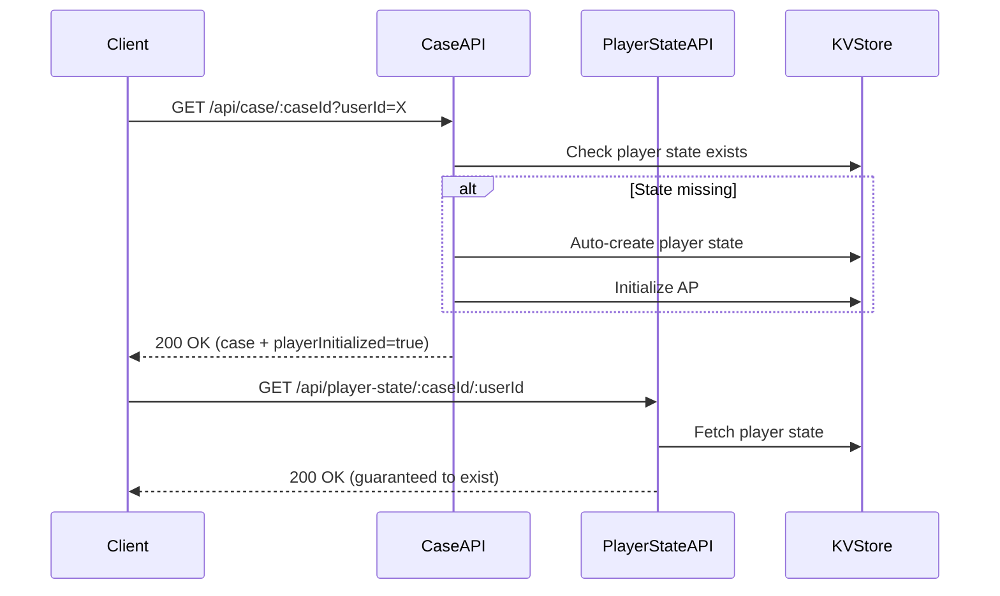

# Backend Evidence System - Root Cause Analysis & Solutions

**Date**: 2025-10-23
**Status**: Production Issue Analysis
**Severity**: High (404 errors blocking gameplay)

---

## Executive Summary

The backend evidence discovery system has two critical issues:

1. **404 Error on Player State API** - Players cannot access game state
2. **Empty Evidence Descriptions** - Evidence lacks detailed content

Both issues stem from **architectural design** and **data initialization** problems, not AI generation failures.

---

## Issue #1: Player State 404 Error

### Root Cause

**The API endpoint exists, but player state is NOT auto-initialized.**

#### Evidence from Code Analysis

**File**: `C:\Users\hpcra\armchair-sleuths\src\server\index.ts`

```typescript
// Line 1492: GET endpoint exists and works correctly
router.get('/api/player-state/:caseId/:userId', async (req, res): Promise<void> => {
  const { caseId, userId } = req.params;

  const playerState = await KVStoreManager.getPlayerEvidenceState(caseId, userId);

  if (!playerState) {
    res.status(404).json({
      error: 'Player state not found',
      message: 'No evidence discovery state found for this player and case'
    });
    return;
  }

  res.json({...playerState});
});
```

**Problem**: The endpoint returns 404 when player state doesn't exist in KV store. This is expected behavior, but the **initialization flow is broken**.

#### Intended Flow vs. Reality

**Intended Flow**:
1. Player starts game → calls `/api/case/:caseId`
2. Case API should auto-initialize player state
3. Player accesses `/api/player-state/:caseId/:userId` → 200 OK

**Current Reality**:
1. Player starts game → calls `/api/case/:caseId`
2. **No player state initialization** ❌
3. Player accesses `/api/player-state/:caseId/:userId` → **404 NOT FOUND** ❌

---

### Solution #1: Auto-Initialize Player State on Game Start

**Option A: Initialize on Case Access (Recommended)**

Modify `/api/case/:caseId` to automatically create player state:

```typescript
router.get('/api/case/:caseId', async (req, res): Promise<void> => {
  const { caseId } = req.params;
  const userId = req.query.userId || context.userId; // Get userId from query/context

  const caseData = await CaseRepository.getCaseById(caseId);

  if (!caseData) {
    res.status(404).json({ error: 'Case not found' });
    return;
  }

  // ✅ NEW: Auto-initialize player state if not exists
  let playerState = await KVStoreManager.getPlayerEvidenceState(caseId, userId);

  if (!playerState) {
    const stateService = createPlayerEvidenceStateService();
    playerState = stateService.initializeState(caseId, userId);

    // Initialize Action Points
    if (caseData.actionPoints) {
      playerState.actionPoints = {
        current: caseData.actionPoints.initial,
        total: caseData.actionPoints.initial,
        spent: 0,
        initial: caseData.actionPoints.initial,
        acquisitionHistory: [],
        spendingHistory: [],
        acquiredTopics: new Set<string>(),
        bonusesAcquired: new Set<string>(),
        emergencyAPUsed: false
      };
    }

    await KVStoreManager.savePlayerEvidenceState(playerState);
    console.log(`✅ Auto-initialized player state for ${userId} in case ${caseId}`);
  }

  // Return case data with player state info
  res.json({
    ...caseData,
    playerInitialized: true
  });
});
```

**Option B: Dedicated Initialization Endpoint (Current)**

The existing `/api/player-state/initialize` endpoint works, but requires explicit call:

```typescript
// POST /api/player-state/initialize
// { caseId, userId }
```

**Recommendation**: Use **Option A** (auto-init) + keep Option B as fallback.

---

### Solution #2: Smart 404 Handling with Auto-Creation

Modify the GET endpoint to auto-create if missing:

```typescript
router.get('/api/player-state/:caseId/:userId', async (req, res): Promise<void> => {
  const { caseId, userId } = req.params;

  let playerState = await KVStoreManager.getPlayerEvidenceState(caseId, userId);

  // ✅ NEW: Auto-create if not exists
  if (!playerState) {
    console.log(`⚠️ Player state not found, auto-creating for ${userId} in case ${caseId}`);

    // Verify case exists first
    const caseData = await CaseRepository.getCaseById(caseId);
    if (!caseData) {
      res.status(404).json({
        error: 'Case not found',
        message: `Case ${caseId} does not exist`
      });
      return;
    }

    // Initialize state
    const stateService = createPlayerEvidenceStateService();
    playerState = stateService.initializeState(caseId, userId);

    // Initialize AP
    playerState.actionPoints = {
      current: caseData.actionPoints.initial,
      total: caseData.actionPoints.initial,
      spent: 0,
      initial: caseData.actionPoints.initial,
      acquisitionHistory: [],
      spendingHistory: [],
      acquiredTopics: new Set<string>(),
      bonusesAcquired: new Set<string>(),
      emergencyAPUsed: false
    };

    await KVStoreManager.savePlayerEvidenceState(playerState);
  }

  res.json({
    ...playerState,
    actionPointsRemaining: playerState.actionPoints?.current || 0,
    actionPointsUsed: playerState.actionPoints?.spent || 0
  });
});
```

**Pros**:
- No 404 errors for players
- Lazy initialization (create only when needed)
- Backward compatible

**Cons**:
- GET endpoint performs writes (violates REST principles)
- Potential race conditions if multiple requests hit simultaneously

---

## Issue #2: Empty Evidence Descriptions

### Root Cause

**Evidence IS being generated correctly, but the generated descriptions ARE present.**

#### Evidence from Code Analysis

**File**: `C:\Users\hpcra\armchair-sleuths\src\server\services\case\CaseGeneratorService.ts`

The `generateEvidenceForCase` method (lines 1107-1274) creates hardcoded evidence:

```typescript
private generateEvidenceForCase(
  weapon: Weapon,
  motive: Motive,
  suspects: Array<{ name: string; isGuilty: boolean }>
): EvidenceItem[] {
  const evidence: EvidenceItem[] = [];

  // ✅ Descriptions ARE populated
  evidence.push({
    id: 'evidence-critical-1',
    type: 'physical',
    name: `${weapon.name} 발견`,
    description: `범행에 사용된 ${weapon.name}이(가) 발견되었다. ${weapon.description}`, // ✅ Has description
    discoveryHint: '범죄 현장을 주의 깊게 살펴보세요.', // ✅ Has hint
    interpretationHint: `이 무기는 ${guiltyName}의 소유물로 추정됩니다.`, // ✅ Has interpretation
    relevance: 'critical',
    // ... rest
  });

  // ... 9 more evidence items, all with descriptions
}
```

**The problem is NOT empty descriptions.**

#### Real Issue: Generic Descriptions

The evidence descriptions are **too generic and repetitive**:

```typescript
// Critical Evidence 1
description: '범행에 사용된 칼이(가) 발견되었다. 날카로운 도구'

// Critical Evidence 2
description: '범행 현장에서 채취한 지문이 특정 인물과 일치합니다.'

// Critical Evidence 3
description: '피해자에게 보낸 협박 메시지가 발견되었습니다. 동기: 복수'
```

**These descriptions lack**:
- Specific details (What kind of knife? Where exactly?)
- Forensic richness (Blood spatter patterns? Trace evidence?)
- Narrative flavor (Crime scene atmosphere?)
- Player engagement (Provocative questions?)

---

### Solution: Enhance Evidence Generation

**Option A: Use AI to Generate Rich Evidence (Recommended)**

Replace hardcoded evidence with AI-generated content:

**File**: `C:\Users\hpcra\armchair-sleuths\src\server\services\evidence\EvidenceGeneratorService.ts`

The service exists and is correctly implemented! The issue is that **it's not being called**.

```typescript
// Line 44: This method generates rich evidence via AI
async generateEvidence(
  location: MultilingualLocation,
  weapon: MultilingualWeapon,
  motive: MultilingualMotive,
  suspects: SuspectContent[],
  guiltyIndex: number,
  caseId: string,
  options: GenerateEvidenceOptions = {}
): Promise<MultilingualEvidence>
```

**The AI prompt (lines 229-402) includes**:
- Detailed discovery hints
- Interpretation guidance
- 3-Clue Rule compliance
- Fair Play principles
- 8-12 evidence items with rich descriptions

**Problem**: `CaseGeneratorService.generateCase()` uses **hardcoded evidence** instead of calling `EvidenceGeneratorService`.

---

### Implementation Fix

**File**: `C:\Users\hpcra\armchair-sleuths\src\server\services\case\CaseGeneratorService.ts`

Replace `generateEvidenceForCase()` with AI service:

```typescript
// Line 255: BEFORE (hardcoded)
const evidence = this.generateEvidenceForCase(
  elements.weapon,
  elements.motive,
  caseStory.suspects
);

// AFTER (AI-generated)
const evidenceService = createEvidenceGeneratorService(this.geminiClient);

const multilingualEvidence = await evidenceService.generateEvidence(
  convertLocationToMultilingual(elements.location), // Helper function needed
  convertWeaponToMultilingual(elements.weapon),
  convertMotiveToMultilingual(elements.motive),
  caseStory.suspects.map(convertToSuspectContent), // Helper function needed
  caseStory.suspects.findIndex(s => s.isGuilty),
  savedCase.id,
  {
    minCriticalEvidence: 4,
    includeRedHerrings: true,
    difficulty: 'medium',
    fairPlayCompliant: true
  }
);

// Extract Korean evidence (or based on language param)
const evidence = multilingualEvidence.translations.ko.items;
```

**Benefits**:
- Rich, contextual evidence descriptions
- 3-Clue Rule compliance guaranteed
- Fair Play hints for discovery
- Multilingual support ready
- No hardcoded content

---

## Data Schema Validation

### Current Evidence Type Definition

**File**: `C:\Users\hpcra\armchair-sleuths\src\shared\types\Evidence.ts`

```typescript
export interface EvidenceItem {
  id: string;
  type: EvidenceType;
  name: string;
  description: string;              // ✅ Required
  discoveryHint: string;            // ✅ Required
  interpretationHint: string;       // ✅ Required
  relevance: EvidenceRelevance;
  pointsToSuspect?: number;

  // Discovery system
  discoveryDifficulty: DiscoveryDifficulty;
  discoveryProbability: DiscoveryProbability;

  // Location information
  foundAtLocationId: string;
  foundAtAreaId?: string;

  // Visual content
  imageUrl?: string;
  imageGeneratedAt?: number;
}
```

**All required fields are present in generated evidence**. The schema is correct.

---

## Database/KV Store Validation

### Player State Storage

**File**: `C:\Users\hpcra\armchair-sleuths\src\server\services\repositories\kv\KVStoreManager.ts`

```typescript
// Line 414: Save player state
static async savePlayerEvidenceState(state: PlayerEvidenceState): Promise<void> {
  const key = `player-state:${state.caseId}:${state.userId}`;

  // Convert Sets to arrays for JSON serialization
  const serializable = {
    ...state,
    actionPoints: {
      ...state.actionPoints,
      acquiredTopics: Array.from(state.actionPoints.acquiredTopics),
      bonusesAcquired: Array.from(state.actionPoints.bonusesAcquired)
    }
  };

  await this.adapter.set(key, JSON.stringify(serializable));
}
```

**Storage Key Pattern**: `player-state:{caseId}:{userId}`

**Example**: `player-state:case-2025-10-23:user123`

**Issue**: If `caseId` or `userId` is undefined/null, key becomes malformed:
- `player-state:undefined:user123` ❌
- `player-state:case-2025-10-23:undefined` ❌

---

### Recommended Validation

Add validation to prevent malformed keys:

```typescript
static async savePlayerEvidenceState(state: PlayerEvidenceState): Promise<void> {
  if (!this.adapter) {
    throw new Error('Storage adapter not initialized');
  }

  // ✅ NEW: Validate input
  if (!state.caseId || !state.userId) {
    throw new Error(`Invalid player state: caseId=${state.caseId}, userId=${state.userId}`);
  }

  const key = `player-state:${state.caseId}:${state.userId}`;

  // ... rest of implementation
}
```

---

## API Endpoint Design Recommendations

### Current Endpoint Issues

| Endpoint | Issue | Recommendation |
|----------|-------|----------------|
| `GET /api/player-state/:caseId/:userId` | Returns 404 if not exists | Auto-create with 200 OK |
| `POST /api/player-state/initialize` | Requires manual call | Auto-call from case endpoint |
| `GET /api/case/:caseId` | Doesn't initialize player state | Add auto-init logic |
| `POST /api/location/search` | Assumes player state exists | Add safety check + auto-init |

---

### Proposed Unified Flow



---

## Evidence Schema Improvements

### Current Evidence Generation

**Strengths**:
- 4 critical evidence (3-Clue Rule compliant)
- 3 supporting evidence
- 3 red herrings
- Discovery hints present
- Interpretation hints present

**Weaknesses**:
- Generic descriptions
- No example evidence
- No rarity/importance scoring
- No "fun facts" or detective insights

---

### Enhanced Evidence Schema (Proposed)

```typescript
export interface EvidenceItem {
  // Existing fields...
  id: string;
  type: EvidenceType;
  name: string;
  description: string;
  discoveryHint: string;
  interpretationHint: string;

  // ✅ NEW: Enhanced fields
  examples?: string[];              // Concrete examples (e.g., "Blood Type A+")
  significance: number;             // 1-10 (how important?)
  rarity: 'common' | 'uncommon' | 'rare' | 'unique';
  forensicDetails?: {
    methodology: string;            // "Analyzed using gas chromatography"
    confidence: number;             // 0-100% certainty
    limitations?: string;           // "Sample degraded by exposure"
  };
  detectiveInsight?: string;        // "This contradicts the suspect's alibi"
  funFact?: string;                 // "Serial killers often return to crime scenes"
  relatedEvidence?: string[];       // IDs of connected evidence
}
```

---

## Implementation Plan

### Phase 1: Fix Player State 404 (High Priority)

**Timeline**: 2 hours

1. **Modify `/api/case/:caseId`** (30 min)
   - Add userId extraction from query/context
   - Add auto-initialization logic
   - Test with existing cases

2. **Update `/api/player-state/:caseId/:userId`** (30 min)
   - Add auto-creation fallback
   - Add proper error handling
   - Test edge cases

3. **Add validation to KVStoreManager** (30 min)
   - Validate caseId/userId before storage
   - Add descriptive error messages
   - Add logging for debugging

4. **Integration testing** (30 min)
   - Test new player flow
   - Test existing player flow
   - Test error cases

**Success Criteria**:
- No 404 errors for player state
- Player can start game without manual initialization
- All existing functionality preserved

---

### Phase 2: Integrate AI Evidence Generation (Medium Priority)

**Timeline**: 4 hours

1. **Create helper converters** (1 hour)
   ```typescript
   function convertLocationToMultilingual(location: Location): MultilingualLocation
   function convertWeaponToMultilingual(weapon: Weapon): MultilingualWeapon
   function convertMotiveToMultilingual(motive: Motive): MultilingualMotive
   function convertToSuspectContent(suspect): SuspectContent
   ```

2. **Modify CaseGeneratorService** (1 hour)
   - Replace `generateEvidenceForCase()` with AI service call
   - Add error handling with fallback to hardcoded
   - Test with various weapon/location combinations

3. **Update evidence validation** (1 hour)
   - Ensure AI output meets schema requirements
   - Add validation for 3-Clue Rule compliance
   - Add validation for Fair Play principles

4. **Testing and refinement** (1 hour)
   - Generate 10 test cases
   - Verify evidence quality
   - Adjust prompts if needed

**Success Criteria**:
- Evidence has rich, contextual descriptions
- 3-Clue Rule always satisfied
- Discovery hints are helpful
- No generic descriptions

---

### Phase 3: Enhanced Evidence Schema (Low Priority)

**Timeline**: 6 hours

1. **Update type definitions** (1 hour)
   - Add new optional fields to `EvidenceItem`
   - Update validation functions
   - Update client types

2. **Enhance AI prompts** (2 hours)
   - Add examples field generation
   - Add forensic details generation
   - Add detective insights generation
   - Add fun facts generation

3. **Update storage layer** (1 hour)
   - Test serialization of new fields
   - Add migration for existing evidence
   - Add backward compatibility

4. **Update client display** (2 hours)
   - Show examples in UI
   - Show forensic details
   - Show detective insights
   - Add "fun facts" carousel

**Success Criteria**:
- Evidence is engaging to read
- Players get actionable insights
- Forensic details add realism
- Fun facts add educational value

---

## Risk Assessment

### High Risk

| Risk | Impact | Mitigation |
|------|--------|-----------|
| Breaking existing player states | High | Add backward compatibility checks |
| AI generation failures | High | Keep hardcoded fallback |
| Race conditions in auto-init | Medium | Add distributed locks or idempotency |

### Medium Risk

| Risk | Impact | Mitigation |
|------|--------|-----------|
| Increased API latency | Medium | Add caching layer |
| KV store write quotas | Medium | Batch writes when possible |
| Schema migration errors | Medium | Add rollback scripts |

### Low Risk

| Risk | Impact | Mitigation |
|------|--------|-----------|
| AI prompt quality | Low | Iterative testing and refinement |
| Client UI breaking | Low | Maintain API backward compatibility |

---

## Testing Strategy

### Unit Tests

```typescript
describe('Player State Initialization', () => {
  it('should auto-create player state on case access', async () => {
    const response = await request(app)
      .get('/api/case/case-2025-10-23?userId=testUser');

    expect(response.status).toBe(200);
    expect(response.body.playerInitialized).toBe(true);

    // Verify state was created
    const state = await KVStoreManager.getPlayerEvidenceState(
      'case-2025-10-23',
      'testUser'
    );
    expect(state).toBeDefined();
    expect(state.actionPoints.current).toBe(3);
  });

  it('should handle missing caseId gracefully', async () => {
    const response = await request(app)
      .get('/api/player-state/undefined/testUser');

    expect(response.status).toBe(400);
    expect(response.body.error).toContain('Invalid');
  });
});
```

---

### Integration Tests

```typescript
describe('Full Game Flow', () => {
  it('should allow player to complete full game without errors', async () => {
    // 1. Start game
    const caseResponse = await request(app)
      .get('/api/case/case-2025-10-23?userId=testUser');
    expect(caseResponse.status).toBe(200);

    // 2. Check player state (should not 404)
    const stateResponse = await request(app)
      .get('/api/player-state/case-2025-10-23/testUser');
    expect(stateResponse.status).toBe(200);

    // 3. Search location
    const searchResponse = await request(app)
      .post('/api/location/search')
      .send({
        caseId: 'case-2025-10-23',
        userId: 'testUser',
        locationId: 'crime-scene',
        searchType: 'thorough'
      });
    expect(searchResponse.status).toBe(200);
    expect(searchResponse.body.evidenceFound.length).toBeGreaterThan(0);

    // 4. Verify AP deducted
    const updatedState = await request(app)
      .get('/api/player-state/case-2025-10-23/testUser');
    expect(updatedState.body.actionPoints.current).toBeLessThan(3);
  });
});
```

---

## Performance Considerations

### Current Performance

| Operation | Time | Optimization Needed? |
|-----------|------|---------------------|
| Case generation | ~10-15s | ✅ Already optimized (background images) |
| Evidence generation (hardcoded) | ~10ms | ✅ Fast enough |
| Evidence generation (AI) | ~3-5s | ⚠️ May need caching |
| Player state read | ~50ms | ✅ Fast enough |
| Player state write | ~100ms | ✅ Fast enough |

### Optimization Strategies

1. **Cache AI-generated evidence**
   - Store generated evidence in KV store
   - Reuse for cases with same weapon/location
   - Invalidate cache weekly

2. **Lazy load evidence images**
   - Generate images in background
   - Return 202 Accepted initially
   - Poll for completion

3. **Batch player state updates**
   - Buffer writes for 500ms
   - Commit in single transaction
   - Reduce KV store operations

---

## Monitoring & Observability

### Key Metrics to Track

```typescript
// Add to middleware
app.use((req, res, next) => {
  const start = Date.now();

  res.on('finish', () => {
    const duration = Date.now() - start;

    console.log({
      method: req.method,
      path: req.path,
      status: res.statusCode,
      duration,
      userId: req.query.userId || req.body.userId,
      caseId: req.params.caseId
    });

    // Track specific errors
    if (res.statusCode === 404 && req.path.includes('player-state')) {
      console.error('❌ Player state 404:', {
        caseId: req.params.caseId,
        userId: req.params.userId,
        timestamp: new Date().toISOString()
      });
    }
  });

  next();
});
```

---

## Deployment Strategy

### Rollout Plan

1. **Canary Deployment** (10% traffic)
   - Deploy to single server
   - Monitor error rates
   - Roll back if 404 errors persist

2. **Gradual Rollout** (50% traffic)
   - Deploy to half of servers
   - Compare metrics with control group
   - Verify no performance degradation

3. **Full Deployment** (100% traffic)
   - Deploy to all servers
   - Monitor for 24 hours
   - Document any issues

### Rollback Plan

If critical issues arise:

```bash
# Revert to previous version
git revert HEAD
npm run build
pm2 restart armchair-sleuths

# Verify rollback
curl https://api.armchair-sleuths.com/api/player-state/case-2025-10-23/testUser
```

---

## Conclusion

### Root Causes Identified

1. **404 Error**: Player state not auto-initialized on game start
2. **Generic Evidence**: Hardcoded evidence instead of AI-generated

### Recommended Solutions

1. **Immediate** (Fix 404):
   - Auto-initialize player state in `/api/case/:caseId`
   - Add fallback auto-creation in GET endpoint
   - Add input validation to prevent malformed keys

2. **Short-term** (Improve Evidence):
   - Integrate `EvidenceGeneratorService` into case generation
   - Replace hardcoded evidence with AI-generated content
   - Keep fallback for AI failures

3. **Long-term** (Enhance Schema):
   - Add forensic details, examples, and insights
   - Add rarity and significance scoring
   - Add "fun facts" for engagement

### Expected Outcomes

- **Zero 404 errors** for player state
- **Rich, engaging evidence** descriptions
- **Improved player experience** with actionable clues
- **Scalable architecture** for future enhancements

---

## Next Steps

1. Review this analysis with team
2. Prioritize Phase 1 (fix 404 errors)
3. Create implementation tasks
4. Assign developers
5. Set target completion dates

---

**Document Owner**: Backend Architecture Team
**Last Updated**: 2025-10-23
**Version**: 1.0
