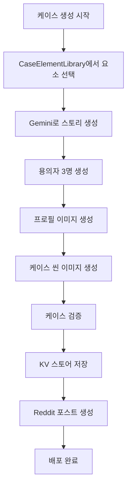

# Mystery Case Generator

## Overview

This skill automates the complete case generation pipeline for Armchair Sleuths AI murder mystery game, handling the entire workflow from case element selection to Reddit deployment.

## When to Use This Skill

**This skill should be used when:**
- Creating a new case: "새 케이스 만들어줘" / "Create a new case"
- Generating today's case: "오늘의 케이스 생성" / "Generate today's case"
- Generating and deploying cases: "케이스 생성 및 배포" / "Generate and deploy case"
- Generating cases with images: "이미지 포함 케이스 생성" / "Generate case with images"
- Validating cases: "케이스 검증" / "Validate case"

## Core Workflow

### Complete Case Generation Pipeline



## Quick Start

### 1. Generate Basic Case

```bash
npx tsx scripts/generate-case.ts
```

Generates a complete case with victim, 3 suspects (1 guilty), and 5W1H solution using CaseElementLibrary and Gemini API.

### 2. Generate Case with Images

```bash
npx tsx scripts/generate-case.ts --with-images
```

Generates case plus suspect profile images and case scene image using gemini-image-generator skill.

### 3. Validate Case

```bash
npx tsx scripts/validate-case.ts --case-id case-2025-01-19
```

Validates case integrity: guilty suspect count, 5W1H completeness, data consistency.

### 4. Deploy to Reddit

```bash
npx tsx scripts/deploy-case.ts --case-id case-2025-01-19
```

Creates Devvit post on Reddit after validation.

## Integration with Project

This skill integrates with the project structure:

```
armchair-sleuths/
├── skills/
│   ├── mystery-case-generator/     # This skill
│   ├── gemini-image-generator/     # Used for image generation
│   └── suspect-ai-prompter/        # Used for suspect dialogue
├── scripts/                         # Scripts copied from skill
│   ├── generate-case.ts
│   ├── validate-case.ts
│   └── deploy-case.ts
├── src/server/services/
│   ├── CaseGeneratorService.ts
│   └── ImageGenerator.ts
└── package.json
```

**Recommended npm scripts:**
```json
{
  "scripts": {
    "case:generate": "tsx scripts/generate-case.ts",
    "case:generate:images": "tsx scripts/generate-case.ts --with-images",
    "case:validate": "tsx scripts/validate-case.ts",
    "case:deploy": "tsx scripts/deploy-case.ts"
  }
}
```

## Skill Dependencies

- **gemini-image-generator**: Generate suspect profile and case scene images
- **suspect-ai-prompter**: Optimize suspect dialogue and personality

## References

For detailed information, see the references directory:

- **scripts-guide.md**: Complete script options and usage examples
- **workflow-details.md**: Detailed step-by-step workflow explanation
- **troubleshooting.md**: Error handling and common issues
- **best-practices.md**: Tips for optimal case generation
- **examples.md**: JSON format examples for case data structures
- **case-generation-workflow.md**: Gemini prompt templates and element selection logic
- **validation-rules.md**: Case validation rules and error correction guide
